公金 (Corporate Issuers, 公司发行人) 学习笔记

<!-- more -->

考试占比8%，考点简单，性价比高

## 企业组织与公司治理

### 企业组织形式及其特点

### 上市公司和非上市公司的对比

Exchange listing, liquidity, and price transparency

- Private: **not** trade on exchange, **difficult** to transfer shares, greater chance of owner/manager **overlap**
- Public: trade on exchange, easy to transfer shares

Registration and disclosure requirements (披露要求)

- Private: **non-financial** disclosure
- Public: shares registered, **both** financial & non-financial disclosure

Share issuance
- Private: issue shares through a **private placement** with a legal document to **accredited investors**
- Public: issue shares in the capital market with much **larger size** capital raised from time to time

### 上市公司和非上市公司的转换

Private → Public

1. Initial public offering (**IPO**)
2. Direct listing (**DL**)
    - No new shares issued, no underwriter involved
    - Faster, at a lower cost
3. Acquisition (收购)
    - Acquired by a public company
    - Special Purpose Acquisition Company (**SPAC**, 特殊目的公司): blank check

Public → Private

1. Take-private / go-private (退市)

### 公司上市数量的趋势变化

发展中国家 Emerging markets: number of public companies **increases**

发达国家 Developed markets: number of public companies **declines**

- Mergers and acquisitions (兼并收购)
- Growing number of private capital sources available (融资途径多样)
- Private companies remain private (无融资需求)

### 债务融资和股权融资

| Issuer Perspective | Debt | Equity |
| :-- | :-- | :-- |
| cost of capital | **lower** | **higher** |
| attractive when future performance is | **predictable** | **unpredictable** |
| risk & financial leverage | higher | lower |

### 债权投资和股权投资

| Investor Perspective | Debt | Equity |
| :-- | :-- | :-- |
| capital tenor 投资期限 | finite | indefinite |
| interests | prior and fixed claims | **residual claims** 剩余索取权 |
| maximum loss | **initial investment** | **initial investment** |
| return potential | **capped** | unlimited |
| investment risk | lower | higher |
| voting rights | no | yes |

### 公司治理和利益相关方理论

公司治理 (**corporate governance**): the system of **internal controls and procedures** by which individual companies are managed

股东理论 (**shareholder theory**): the most important responsibility of a company's managers is to **maximize shareholder value**

利益相关方理论 (**stakeholder theory**): focuses on the **interest of all stakeholder groups**, and try to **minimize and manage the conflicting interests between stakeholders**

利益相关方 (**stakeholder groups**)

- **shareholders**
- customers
- managers and employees
- board of directors
- suppliers
- government
- debt-holders
    - **Private debt-holders** 私募债券人 have more direct access to management and non-public information than bondholders

### 委托代理问题

股东 vs 高管层 (Shareholder vs. Management)
股东 vs 董事会 (Shareholder vs. Board director)

- **Entrenchment**: avoiding risks to retain jobs
- **Empire building**
- Inappropriate risk appetite
    - Stock grants and options dominate: **excessive risk-taking**
    - Little or no use of stock grants and options: **risk-averse**
- Insufficient effort
- Self-dealing

控股股东 vs 中小股东 (Controlling vs. Minority shareholder)

- Concentrated ownership (not dispersed ownership)
- Dual-class structure

股权人 vs 债权人 (Shareholders vs. Creditor / Debtholder)

- Different structure of risks and returns

### 公司治理的常用机制

Corporate reporting and transparency 透明化

Shareholder mechanisms

1. shareholder meetings
    - **annual general meeting** (**AGM**) 年度股东大会
    - **extraordinary general meeting** (**EGM**) 临时股东大会
        - Special elections of board members
        - Amendments to bylaws or articles of association
        - Mergers and acquisitions, takeovers, and asset sales
        - Capital increases and voluntary firm liquidation
    - Proxy voting: authorize another to vote
2. **shareholder activism** 积极股东策略（买成大股东）e.g. hedge funds
3. shareholder litigation  e.g. shareholder derivative lawsuits
4. corporate takeovers
    - Proxy contest, tender offers, hostile takeover
    - Anti-takeover measures
        - Staggered board elections: dilute shareholder voting rights
        - Poison pill

Board and management mechanisms

1. 审计委员会 (**audit committee**): monitors the financial reporting process, supervises the internal audit function, and recommends external auditors
2. 薪酬委员会 (**remuneration / compensation committee**): develops and proposes remuneration policies for the directors and key executives, with shareholders' say on pay
3. 提名/治理委员会 (**nomination / covernance committee**): appraises director and manager candidates, and oversees the board election process, the establishment, and enforcement of corporate policies
4. 上述三个委员会的人都应该是独立董事: All members are independent, as best practices
5. 风险管理委员会 (risks committee)
6. 投资委员会 (investment committee)

Creditor mechanisms

- 债权契约 Bond indenture
- 债权人委员会 Creditor committees, Ad hoc committee

Other mechanisms

1. Employee mechanisms
    - Labor laws, employment contracts
2. Customer and supplier mechanisms
    - Contractual agreement
    - Social media
3. Government mechanisms
    - Laws and regulations
    - Guiding principles: corporate governance codes

### 公司治理的影响

Risks of poor governance

- Weak control systems
- Legal, regulatory, reputational risks
- Default and bankruptcy risks
- Poor decision making, improperly avoiding investments that create shareholder value

### ESG考量

**ESG** (**environmental, social, and governance**): factors are increasingly prioritized in investment decisions

Environmental factors

- Climate change
    - **Physical risk**
    - **Transition risk** (e.g. **stranded assets** 搁浅资产)
- Pollution and waste, deforestation, water scarcity, biodiversity

Social factors

- firm's practices concerning, and their impacts on, its employees and human capital, customers, and communities in which it operates

Governance factors

- Corporate governance & stakeholder management
- Evolved **more quickly** into investment analysis than environmental & social factors, and government continues to **prioritize** climate change and social policies (G比ES更重要)

## 营运资本和流动性管理

### 流动性的来源

首要的流动性来源 (**primary liquidity sources**)

- Cash and marketable securities on hand: be sold quickly **without significant loss of value** 现金及交易性金融资产
- **Borrowings** or **suppliers' trade credit** 正常的借贷行为、应付账款
- Cash flow from the business
    - **Cash flow from operations**
    - **Free cash flow** = CFO - investments in long-term assets

次要的流动性来源 (**secondary liquidity sources**)

- **Suspend or reduce dividends** to shareholders
- **Delay or reduce capital expenditures**: miss opportunities and impair long-term value
- **Issue equity**: dilution for existing shareholders
- **Renegotiate contract terms**
- **Sell assets**
- File for bankruptcy protection and reorganization
    - Liquidation costs
        - Fees and commissions for selling an asset
        - Reduction in value due to asset's illiquidity

### 流动性的恶化

**Drags on liquidity**: **decelerate cash inflows** 流入速度变慢

- uncollected receivables
- obsolete inventory
- borrowing constraints

**Pulls on liquidity**: **accelerate cash outflows** 流出速度变快

- making payment early
- reduced trade credit limits or short-term lines of credit
- chronic liquidity shortages 流动性短缺

### 流动性管理的相关指标

Generally, the **higher** the liquidity ratios, the better a company's liquidity

衡量短期偿债能力

流动比率 (**current ratio**) = 流动资产 / 流动负债

$$ \text{current ratio} = \text{current assets} / \text{current liabilities} $$

速动比率 (**quick ratio**) 又称酸性测试比率 (**acid-test ratio**)

$$ \text{quick ratio} = (\text{cash} + \text{short term marketable security} + \text{receivable}) / \text{current liabilities} $$

现金比率 (**cash ratio**)

$$ \text{quick ratio} = (\text{cash} + \text{short term marketable security}) / \text{current liabilities} $$

以一年或者经营周期（较长的那个）作为比较周期

### 经营效率管理的相关指标

```mermaid
---
displayMode: compact
config:
    theme: forest
    themeCSS: ".grid .tick {opacity: 0}"
    gantt:
---
gantt
    dateFormat D
    axisFormat %e

    operation cycle 经营周期: active, 1, 4

    section milestone
    采购        :milestone, m0, 1, 0
    支付货款     :milestone, m1, 2, 0
    售出商品     :milestone, m2, 3, 0
    收回现金     :milestone, m3, 4, 0
    
    section  
    days of inventory on hand, DOH :active, 1, 3
    days sales outstanding, DSO    :active, 3, 4

    days payable outstanding   :active, 1, 2
    cash convension cycle, 现金转换周期, 净经营周期 :active, 2, 4
```

现金转换周期 (**cash conversion cycle**): the time from paying suppliers for inventory to collecting cash from the subsequent sale of goods

$$ \text{cash conversion cycle} = \text{DOH} + \text{DSO} - \text{days payable outstanding} $$

The **shorter** or even **negative** conversion cycle, the more efficient business operations

### 应付账款优惠条款

Payment terms of trade payables of "**a / m, net n**"

表示：如果第n天支付，需要付100%的钱；如果第m天支付，需要付(100-a)%的钱

Effective annual rate (EAR) on the trade credit

$$ \text{EAR} = [(\frac{1}{1 - a\%})^{\frac{365}{n-m}}] - 1 $$

### 营运资本的计算

营运资本 (**WC**) = 流动资本 - 流动负债

$$ \text{total working capital} = \text{current assets} - \text{current liabilities} $$

净营运资本 (**net working capital**) 只考虑营业相关的

$$ \text{net working capital} = (\text{current assets} - \text{cash \& marketable securities}) - (\text{current liabilities} - \text{short term \& current debt}) $$

### 营运资本的管理方式

保守型 (**conservative**)

- More cash, receivables and inventories
- More reliance on **long-term funding sources** 长期融资来源

激进型 (**aggressive**)

- Minimize excess cash, receivables and inventories
- More reliance on **short-term funding sources** 短期融资来源

适中型 (**moderate**)

- between the two approaches above

### 短期融资

短期融资目标

- Maintain **sufficient** and **diversified** sources of credit to **fund ongoing cash needs**
- Secure **adequate funding capacity** to handle the firm's changing cash needs
- Ensure that rates, terms and conditions competitive
- Ensure both **implicit and explicit financing costs** are considered

短期融资策略的影响因素

- Company size and creditworthiness
- Legal and regulatory constraints
- Underlying assets as collaterals

## 资本投资

### 资本投资项目分类

**Business maintenance**

1. **Going concern** (**maintenance**)
    - Continue current operations
    - Improve efficiency
    - Risk management
2. **Regulatory / Compliance**
    - 根据监管机构要求

**Business growth**

1. **Expansion of existing business**: low to moderate risk
    - Expand business size or scope
    - R&D and acquisitions **within** core business
2. **New lines of business and other**: high risk
    - R&D and acquisitions **outside** current business

### 资本投资的基本原则

税后增量现金流 (**after-tax incremental cash flows**)

- 包括
    - 外部性 **externalities** (negative or positive effect)
    - **opportunity cost** (e.g. timing of cash flows)
- 不包括
    - 沉没成本 **sunk costs**, which is the cost have already been incurred

### 投资决策：净现值

净现值 (**net presetn value**, **NPV**): the sum of the present value of all the after-tax incremental cash flows

$$ \text{NPV} = \text{CF}_0 + \frac{\text{CF}_1}{(1+r)^1} + \cdots + \frac{\text{CF}_n}{(1+r)^n} \quad = \text{initial investment} + \text{PV of future CF}$$

其中，r是 **require rate of return** of capital suppliers，也是 **cost of capital** of capital receivers

对**单一** (**single**) 项目或**独立** (**independent**) 项目的评估

- if NPV > 0, then accept & invest
- if NPV < 0, then reject & deny & do not invest

Advantages: directly reflects the expect change of firm's value
Disadvantages: **ignore the size of the project**

### 投资决策：内部回报率

内部回报率 (**internal rate of return**, **IRR**): the **discount rate** that makes the total present value of all cash flows, the NPV, equal to zero

$$ \text{NPV} = 0 = \text{CF}_0 + \frac{\text{CF}_1}{(1+\text{IRR})^1} + \cdots + \frac{\text{CF}_n}{(1+\text{IRR})^n} $$

Advantage: reflects the profitability

Disadvantages:

- For projects with **non-conventional cash flows**, there may be **multiple IRRs** or no **IRR**
    - 传统现金流 Conventional cash flows: cash flows change signs once 例如一次投资，之后一直吃回报
    - Non-conventional cash flows: cash flows change signs more than once 有入有出
- Impractical assumption of reinvestment rate (IRR)

For **single** or **independent** project with **conventional cash flows**, NPV and IRR give the **same judgement**
    - If NPV > 0, IRR > cost of capital, then accept the project
    - If NPV < 0, IRR < cost of capital, then reject the project

### 投资决策：资本回报率

资本回报率 (**return on invested capital**, **ROIC**): a measure the profitability relative to the amount of total capital invested

$$
\begin{aligned}
\text{ROIC} &= \text{after-tax operating profit} / \text{average invested capital}  \\
    &= \text{operating profit} \times (1 - \text{tax rate}) / \text{average total long term liabilities \& equity} \\
    &= \text{after-tax operating profit margin} \times \text{capital turnover}
\end{aligned}
$$

Working capital is **not** included in invested capital

If **ROIC > cost of capital**, firm is creating value for investors

Advantage: data for calculation is **available** to independent investment analysts

Disadvantages:

- An accounting, **not cash-based** measure 会计数据更容易被操控
- **Backward-looking** and can be volatile from year to year
- A highly **aggregated** measure that may mask profitable or unprofitable areas 整体指标

### 项目之间的关系

**Project interaction**

- **Independent projects**: projects are unrelated to each other
    - Accept all projects with **positive NPV**
- **Mutually exclusive projects**: projects compete directly with each other
    - Choose the one with **highest positive NPV**

**Unlimited funds**: the firm can raise the funds it wants for all profitable projects

**Capital rationing**: the firm has a fixed amount of funds to invest

**Project sequencing**: projects should be taken in time order

### 多项目抉择的最终决策依据

NPV是最终决策依据，当NPV与IRR冲突时，以NPV为准

NPV and IRR project rankings **may conflict** due to:

- Different sizes of CFs
- Different timing of CFs
- Different reinvestment rate assumptions
    - **NPV** assumes CFs can reinvest **at the cost of capital**
    - **IRR** assumes CFs can reinvest **at project's IRR**

### 实物期权的种类

Types of **real options**

- **timing options** (eg. **delay investment option**)
- **sizing options** (eg. **abandonment option**, growth option)
- **flexibility options** (eg. price-setting flexibility, production flexibility)
- **fundamental options** (eg. gold mine, oil well)

### 实物期权对投资决策的影响

$$ \text{NPV (with option)} = \text{NPV (no option)} + \text{value of real options} - \text{cost of real option} $$

Approaches of evaluating the value of real options

- **decision trees**
    - assign a **probability** and **expected timing to future outcomes**
- **option pricing models**

### 投资决策中常见的错误

认知错误 (**cognitive errors**)

- Internal forecasting errors
    - Incorrect **overhead costs** or **discount rate**
    - Failure to incorporate **competitor responses**
- Ignoring **costs of internal financing**: internal funds as "free", external funds as "expensive"
- Inconsistent treatment of, or ignoring, **inflation**
    - Cash flows and discount rate should be **consistent in nominal or real**

行为偏差 (**behavioral biases**)

- **Inertia** 惯性
    - Although returns on investment are falling, capital investment is still static or rising
- Basing investment decisions on **accounting measures**, such as EPS, net income, ROE
- **Pet project** bias
- Failure to consider **investment alternatives**

## 融资和资本结构

### 加权平均融资成本

融资成本 (**cost of capital**): the required rate of return for capital suppliers

加权平均融资成本 (**weighted average cost of capital**, **WACC**): the most common way
to estimate the cost

债券融资成本 rb < 优先股融资成本 rps < 普通股融资成本 rcs

### 债务融资成本和权益融资成本的影响因素

### 资本结构的影响因素

### MM理论的前提假设

### 无税模式下的MM理论

### 财务危机成本

### 静态权衡理论

### 代理成本

### 自由现金流假说

### 信息不对称成本

### 优序融资理论

## 企业商业模式

### 企业商业模式的基本特征：价值主张

### 企业商业模式的基本特征：价值链条

### 企业商业模式的基本特征：盈利能力和单位经济

### 企业商业模式的类型

### 
