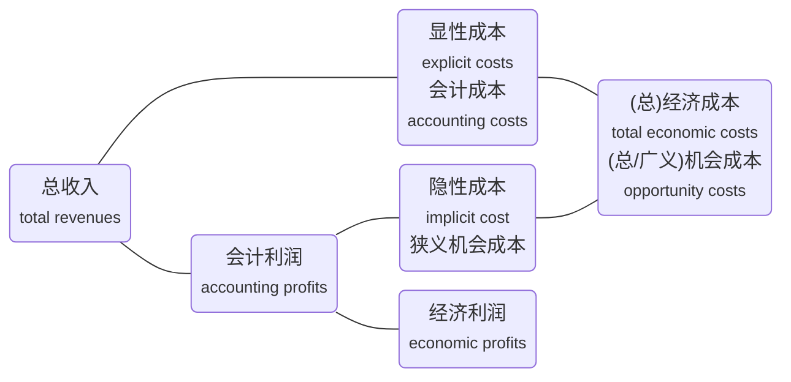
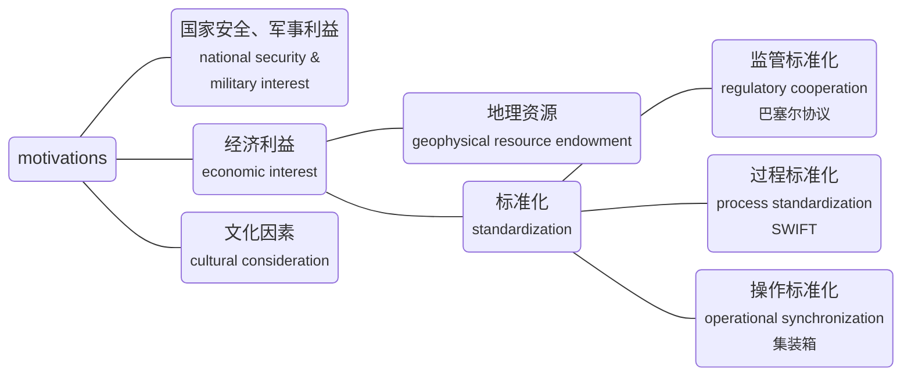

经济（Economics, 经济学）学习笔记

<!-- more -->

## 微观经济：厂商和市场结构

### 需求方的相关概念

需求方：消费者

需求函数 (**demand function**): the relationship between **quantity of demand** 需求量 and variables that have influence on demand

需求定律 (**law of demand**): as price of a good rises, buyers buy less of it; and as its price falls, they buy more

需求曲线 (**demand curve**): graph of the **inverse demand function**

注意横纵坐标是"inverse"的，纵轴为自变量P（价格），横轴为因变量Q（需求）

### 供给方的相关概念：会计利润和经济利润

正常利润 (**normal profit**): the accounting profit that makes economic profit zero

超额利润 (**abnormal profit**): accounting profit larger than normal profit

### 供给方的相关概念：收入

总收入 (**total revenue**): **TR** = P * Q

平均收入 (**average revenue**): **AR** = TR / Q = P

边际收入 (**marginal revenue**): the change in total revenue divided by change in quantity

$$ \text{MR} = \Delta \text{TR} / \Delta \text{Q} \quad \le P $$

完全竞争 (**perfect competition**) 市场

- The individual firm has no impact on market price (**price taker** 价格接受者)
- The individual firm faces a **horizontal demand curve** 水平需求曲线

非完全竞争 (**imperfect competition**) 市场

- The individual firm has enough share of the market and is able to exert some influence over price (**price maker** 价格制定者)
- Firms face **downward-sloping demand curve**
- MR曲线斜率是需求曲线的**两倍**

### 供给方的相关概念：成本

总成本 (**total costs**, **TC**)

总固定成本 (**total fixed costs**, **TFC**)

总可变成本 (**total variable costs**, **TVC**)

图中Q1表示边际成本最低的点，Q2表示平均可变成本最低的点，也是MC=AVC的点，Q3表示平均总成本最低的点，也是MC=ATC的点，可证

$$ Q1 < Q2 < Q3 $$

### 规模经济和规模不经济

长期平均总成本曲线 (**long-run average total cost curve**, **LRATC**): 所有短期平均成本曲线(ATC)的最低点组成的包络线

规模报酬 (**returns to scale**): 增大规模时所获得的报酬，先递增，到达MSE后递减

**Minimum efficient scale** (**MES**): the scale of the minimum point on the LRATC

### 完全竞争市场中的产量决策：利润最大和盈亏平衡

完全竞争市场的一些特征：每人都是价格接受者，需求曲线是水平的（价格固定），四线合一（D=P=AR=MR），经济利润为0，进入和退出壁垒为0，**长期经济利润为0**

利润最大化 (**profit maximizing**): 经济利润最大的点

$$ \text{Max} \Pi (Q*) = TR(Q*) - TC(Q*) $$

$$ MR(Q*) = MC(Q*) $$

盈亏平衡 (**breakeven**): 经济利润等于0的点

$$ TR(Q_1, Q_2) = TC(Q_1, Q_2) $$

$$ P(Q_1, Q_2) = ATC(Q_1, Q_2) $$

短期均衡 (**short equilibrium**): economic profits can be positive

长期均衡 (**long equilibrium**): economic profits **must be zero**

### 均衡价格和均衡产量

考察计算：已知一些曲线，计算最大利润，需要求导数，算出$P*$和$Q*$

### 停业点点价格

停业点是价格决策，不是产量决策

短期停业点 (**short-run shutdown point**): shut down operations

$$ P < \text{AVC} $$

长期停业点 (**long-run shutdown point**): exit the industry

$$ P < \text{ATC} $$

### 供给曲线

完全竞争市场中，供给曲线是边际成本曲线(MC)的右半部分，即在AVC上方的部分

In perfect competition, the firm's supply schedule is represented by the **marginal cost schedule**. The supply curve is MC line above AVC.

非完全竞争市场里，他是斜向上的，但并非现有模型中的一段

In imperfect competition, there is **no well-defined supply function**. It is not represented by either marginal cost or average cost.

### 市场结构分析

| | Number of firms | Degree of Product Differentiation | 进入壁垒 Barriers to Market Entry | 非价格竞争策略 Degree of Non-price Competition |
| :-- | :-- | :-- | :-- | :-- |
| 完全竞争 **Perfect Competition** | very many | 同质化、标准化 homogeneous & standardized | none | none |
| 垄断竞争 **Monopolistic Competition** | many | differentiated | low <small>(in a long term)</small> almost none | advertising & product differentiation |
| 寡头垄断 **Oligopoly** | few | homogeneous & standardized | high | advertising & **product differentiation** |
| 完全垄断 **Monopoly** | one | unique product | very high | **advertising** |

### 均衡状态比较

需求的价格弹性 (**price elasticity of demand**): 价格变动时，需求变动多少

### 市场集中度分析

市场集中度 (**market concentration**)

计量经济方法 (**econometric approaches**)

- Evaluate the elasticity of demand and supply in a market 计算需求和供给的弹性
- To solve the problem of **endogeneity** 内生, we can use **regression** analysis (**time-series**, **cross-sectional** 横截面数据) to calculate the elasticity

Industry concentration measures

行业集中度 (**N firms concentration ratio**): sum of the market shares of the largest N firms in a market 前N家的占有率的和

HHI指数 (**Herfindahl-Hirschman Index**, **HHI**): sum of the squared market share of each firm 每家的占有率的平方和

缺点

- Do not show **potential** entry threat
- Do not consider elasticity of **demand**
- (对于行业集中度) less affected by **mergers**

### 寡头垄断市场的需求分析

拐折的需求曲线 (**kinked demand curve**)

The most common pricing strategy assumption in these price war markets is that competitors will match a price reduction and ignore a price increase 寡头跟跌不跟涨

The price elasticity of demand will be much greater if the price is increased and less if the price is decreased

粘性价格和粘性需求量 **sticky price** and **sticky quantity**

### 博弈论：古诺模型

In the **Cournot** assumption (**duopoly market** 双寡头市场), each firm determines its **profit-maximizing production level** 利润最大化产量决策 by assuming that the other firms' output will not change

要会计算

- 假设两个厂商的产量分别为q1和q2
- 根据市场整体的需求曲线，算出每个市场的经济利润方程
- 每个厂商追求其经济利润最大化，即经济利润的导数为0
- 用两个求导后的方程，做二元一次方程组求解，可得q1和q2在最终稳定状态的值

在多寡头市场下也可以使用

### 博弈论：斯塔克尔伯格模型

斯塔克尔伯格模型 (**Stackelberg model**)

- **Dominant firm** (**DF**, 主导厂商) has a large market share with scale effect, determining the market price as a monopoly company, when MR=MC 类似完全垄断
- Other **competitive firms** (**CF**, followers) take market price as given 类似完全竞争

推论

- If the other companies in the market attempts to gain market share by undercutting the price set by the dominant firm, the market share of the **dominant firm** will increase ultimately 任何人开始价格战会使主导厂商最终收益
- Over time, the dominant company's market share tends to decrease as profit attract entry by other companies 外部公司的进入导致主导厂商份额下降

### 博弈论：纳什均衡

纳什均衡 (**Nash equilibrium**): participants in a **non-cooperative game** have no incentive to deviate from their respective strategies after they have considered and anticipated their opponent's rational choices

Factors affect the successful **collusion** 串谋

1. Number and size distribution of sellers 人越少越容易串谋
2. Similarity of the products 越同质化越容易串谋
3. Cost structure 成本结构相同容易串谋
4. Order size and frequency 订单频率高、单笔订单小容易串谋
5. Strength and severity of retaliation 违约风险小容易串谋
6. Degree of external competition 外部竞争小容易串谋

## 宏观经济：经济周期

### 经济周期分析的三种类型

经典周期 (**classical cycle**): GDP的周期 fluctuations in the level of economic

The **contraction phases** 收缩期 between **peaks** 顶部 and **troughs** 底部 are often **short**, while **expansion phases** 扩张期 are much **longer**

增长周期 (**growth cycle**): fluctuations in economic activity around the long-term potential or trend growth level, and its focus is on how much actual economic activity is below or above trend growth in economic activity (**gap** 产出缺口) 衡量短期波动，GDP与潜在GDP的差值

Compared to the classical cycles, **peaks** are generally reached **earlier** and **troughs later** in time

增长率周期 (**growth rate cycle**): fluctuations in the growth rate of economic activity 产出缺口的导数

**Peaks** and **troughs** are mostly recognized **earlier** than when using the other two definitions

An advantage is that there is **not necessarily** a need to first estimate a long-run growth path 不需要估计长期增长

### 经济周期的四个阶段

对增长周期 growth cycle 划分为四个阶段

不用死记硬背，大致理解即可，就业和通胀具有滞后性

### 经济周期的影响

Consumer behavior

**Consumer confidence** 消费者信心 plays a significant role in spending decisions and reflects expectations of future incomes and employment prospects

Consumer spending: **durable goods** 耐用品 (most **cyclical** 周期性), **services** (cyclical), **non-durable goods** (least cyclical)

**Growth in income** is normally a good indicator of consumption prospects

During the **boom** 经济繁荣阶段, the riskiest assets will often have substantial price increases; safe assets, such as government bonds that were more highly prized during **recession** 经济衰退阶段, may have lower prices and thus higher yields

Housing sector activity (home buying and consequently construction activity) expand in response to lower loan **interest rates**, and it has its **own internal cycle**

**Imports** respond to the **domestic cycle**, and **exports** are more dependent on **cycles in the rest of the world**

### 信贷周期

信贷周期 (**credit cycles**): the changing availability and pricing of credit

When the economy is strong or improving, the willingness of lenders to extend credit, and on favorable terms, is high; conversely, when the economy is weak or weakening, lenders pull back, or "tighten" credit, by making it less available and more expensive

Credit cycles tend to be **longer**, **deeper**, and **sharper** than business cycles

### 复合经济指标

**Composite indicator** is a composite of different variables that all tend to move together

**Diffusion index** 扩散指数 provide a measure of **the breadth of the change in a composite index**

To overcome the publication delay, **nowcasting** 实时预测 uses **real-time monitoring** 实时检测 of economic and financial variables to continuously assess current conditions

### 常见经济指标

领先型经济指标 (**leading economic indicators**): predict the economy's future state

- **Stock market** 股票
- House prices
- Retail sales
- **Interest spreads** between LT and ST rates 基差
- Building permits
- **Consumer expectations**
- **Average weekly hours (manufacturing)** 制造业平均工作时长
- Manufacturers' new orders

同步型经济指标 (**coincident economic indicators**): identify the economy's present state

- **Industrial production index**
- **Real personal incomes** 收入
- Manufacturing and trade sales

滞后型经济指标 (**lagging economic indicators**): identify the economy's past condition and only change after a trend has been established

- **Average duration of unemployment** 失业时间
- **Inventory-sales ratio** 库存销售比
- Change in unit labor costs
- **Inflation** 通胀
- **Average prime lending rate** 最优贷款利率
- Ratio of consumer installment debt to income
- Commercial and industrial outstanding loans

## 宏观经济：政府政策

### 政府经济政策

The overarching goal of both monetary and fiscal policy is normally the creation of an economic environment in which **growth is stable and positive** 稳定正增长 and **inflation is stable and low** 稳定低通胀

货币政策 (**monetary policy**): **central bank** activities that are directed toward influencing the **quantity of money and credit** in an economy

财政政策 (**fiscal policy**): the government's decisions about **taxation** and **spending**

加大税收是紧缩性财政政策；增大支出是扩张性财政政策

### 财政政策的总体目标

Affect the overall level of **aggregate demand** in an economy and the level of economic activity 总需求

Affect **distribution of income and wealth** among different segments of the population 调整贫富差距

Affect the **allocation of resources** between different sectors and economic agents 资源配置

### 财政政策工具

政府支出 (government spending)

- 转移支付 (**transfer payments**)
- 经常性项目支出 (**current government spending**)
- 资本性项目支出 (**capital expenditure**)

政府收入 (government revenues)

- 直接税（直接对财富征税，例如遗产税）(**direct tax**)
- 间接税（消费税、营业税、增值税）(**indirect taxes**)

The discussion of fiscal policy often focuses on the impact of **changes in the difference between government spending and revenue** on the aggregate economy, rather than on the actual levels of spending and revenue themselves

要看财政赤字或财政盈余的变化量，不是单独的支出或收入，不是单期的情况

### 财政政策工具的特点

间接税起效快 **Indirect taxes** can be **adjusted almost immediately** after they are announced and can influence spending behavior instantly and generate revenue for the government **at little or no cost**

Direct taxes are more difficult to change

资本性支出起效慢 **Capital spending** plans take **longer** to formulate and implement

### 不同经济学派的主张

凯恩斯学派 (**Keynesians**): **fiscal policy** can have **powerful effects** on aggregate demand, output, and employment when there is substantial spare capacity in an economy 

货币主义学派 (**Monetarists**): **fiscal changes** only have a **temporary effect** on aggregate demand, and that **monetary policy** is a more **effective** tool for restraining or boosting inflationary pressures

### 财政乘数

政府财政支出的放大作用

**marginal propensity to consume** (**MPC**, 边际消费倾向) + **marginal propensity to saving** (**MPS**, 边际储蓄倾向) = 1

财政乘数 (**fiscal multiplier**)

$$ \text{fiscal multiplie} = 1/ [1 - \text{MPC} \times (1 - t)] $$

其中，$t$为所得税税率

### 财政盈余和财政赤字

预算盈余 (**budget surplus**): government tax revenues exceed expenditures

预算赤字 (**budget deficit**): government expenditures exceed tax revenues

**Government (or national) debt** is the accumulation over time of these deficits, and if the **ratio of debt to GDP** (or, **ratio of interest rate payments to GDP**) rises beyond certain unknown point, then the solvency of the country comes into question

私人部门 (private section): 包括家庭和企业

无需担心政府债务率: Arguments **against** being concerned about national debt

- The debt is owed internally to fellow citizens
- Money borrowed may have been used for capital investment projects or enhancing human capital
- Large fiscal deficits require tax changes
- **Ricardian equivalence** 李嘉图均衡: **private sector may act to offset fiscal deficits** by increasing saving in anticipation of future increased taxes
- Unemployment could be reduced

需要担心政府债务率: Arguments **in favor of** being concerned about national debt

- High levels of debt to GDP lead to higher tax rates in the search for higher tax revenues, which discourages economic activities in future
- Markets may lose confidence in a government, which may lead to high inflation
- Government borrowing may lead to higher interest rates and **lower private sector investing** (**crowding out effect** 挤出效应)

### 紧缩和扩张的财政政策

结构化财政赤字 (**structural budget deficit**): the deficit that would exist if the economy was at **full employment** 充分就业 (or **full potential output** 充分潜在产出)

扩张的财政政策 (**expansionary fiscal policy**): In a recession, governments can raise spending in an attempt to raise employment and output.

- An **increase in a budget deficit** is an expansionary fiscal policy
- **Budget Deficit > Structural Budget Deficit**

紧缩的财政政策 (**contractionary fiscal policy**): In boom times, government spending may be reduced and taxes raised

- An **increase in a budget surplus** (**decrease in a budget deficit**) would be associated with contractionary fiscal policy
- **Budget Deficit < Structural Budget Deficit**

### 财政政策的实施

自动稳定机制 (**automatic stabilizers**): as an economy slows and unemployment rises, government spending on social insurance and unemployment benefits will also rise and add to aggregate demand

相机抉择机制 (**discretionary fiscal policy**): the spending and taxing decisions of a national government that are intended to stabilize the economy

### 财政政策的局限性

识别滞后 (**recognition lag**): time for the government to process data and figure out problem

决策滞后 (**action lag**): time to implement the policy

效果滞后 (**impact lag**): time for the policy to become evident

### 中央银行的角色

- **Monopoly supplier** of the currency 货币的唯一提供商
- Lender of last resort 最后贷款人
- **Conductor of monetary policy** 货币政策的制定者和执行者
- Banker to the government and the bankers' bank 银行的银行
- Regulator and supervisor of the payments system
- Supervisor of the banking system

### 货币政策的目标

The overarching goal of most central banks in **maintaining price stability** 维持物价稳定 is the associated goal of **controlling inflation** 控制通胀

Many developing economies choose to operate monetary policy by **targeting their currency's exchange rate**, rather than an explicit level of domestic inflation 稳定汇率

### 有效体系的判断标准

独立性 **central bank independence**

- 操作独立性 (**operational independence**): central bank was free to set interest rates
- 目标独立性 (**target independence**): central bank was free to make the target inflation rate

可信度 **credibility**

透明度 **transparency**

### 货币政策工具

公开市场操作 (**open market operations**): the **purchase and sale of government bonds from and to commercial banks** and/or designated market makers

- Central bank buys government bonds from commercial banks, increase the reserve of the banks, increase the lending to corporates or households, broad money growth expands

政策利率 (**central bank's policy rate**): the interest rate that a central bank sets and that it announces publicly is normally **the rate at which it is willing to lend money to the commercial banks**

- **Repurchase agreement** 回购: if the central bank wishes to increase the supply of money, it might buy government bonds from the banks, with an agreement to sell them back
- The **federal funds rate** 联邦基金利率 is the **interbank lending rate** on **overnight** 隔夜拆借 borrowings of reserves

存款准备金 (**Reserve requirement**): a central bank could restrict money creation by raising the reserve requirements of banks

$$ \text{money multiplier} = 1 / \text{reserve requirement} $$

### 紧缩和扩张的货币政策

中性利率水平 (**neutral interest rate**): the interest rate **neither spurs nor slows down** the economic growth rate

中性利率水平 = 实际**长期**经济增长率 + **目标**通货膨胀率

$$ \text{neutral interest rate} = \text{real trend rate of economic growth} + \text{inflation target} $$

扩张的货币政策 Expansionary: Policy Rate < Neutral Rate

An expansionary monetary policy tends to increase GDP, increase price level, decrease the interest rate and decrease the value of local currency

紧缩的货币政策 Contractionary: Policy Rate > Neutral Rate

A contractionary monetary policy tends to decrease GDP, decrease price level, increase the interest rate and increase the value of local currency

### 导致高通货膨胀的原因

需求拉动型 (**demand-pull inflation**): the inflation is rising by a **demand shock**

It might be appropriate to **tighten monetary policy** to bring the inflationary pressures generated by these domestic demand pressures under control

成本推动型 (**cost-push inflation**): the inflation is rising by a **supply shock**

Raising interest rates might make a bad situation **worse**

### 货币政策的局限性

债市义勇军 (**bond market vigilantes**): 政府提高短期利率，散户卖出短期债券，买入长期债券，导致长期利率下跌，与紧缩的货币政策初衷相悖

if monetary tightening extreme, expectations to recession may make long-term bonds more attractive, decreasing long-term rate

流动性陷阱 (**liquidity trap**): 超过一定限度后， 增加货币供给，不能再降低利率

if demand for money is very elastic, people will hold additional money balances without any change in the interest rate

量化宽松 (**quantitative easing**, **QE**): 不只买国债，也买企业债等

buying longer-dated government securities, mortgage securities, and risky bonds to low long-term interest rate

### 财政政策和货币政策的综合运用

## 国际经济：地缘政治

### 地缘政治的参与体

地缘政治 (**geopolitics**)

地缘政治的参与体 (**actors**)

Within the field of **geopolitics**, analysts study **actors** — the individuals, organizations, companies, and national governments that carry out political, economic, and financial activities — and how they interact with one another

政府参与体 (**state actors**): typically **national governments**, **political organizations**, or **country leaders** that exert authority over a country's national security and resources

非政府参与体 (**non-state actors**): those that participate in global political, economic, or financial affairs but do **not directly control** national security or country resources

### 政治合作

合作 (**cooperation**): the process by which countries work together toward shared goal or purpose

合作国家 (**cooperative country**): one who engages and reciprocates in **rules standardization**, **harmonization of tariffs**, **international agreements on trade**, **immigration**, or **regulation**; and allows for the **free flow of information**, including **technology transfer**

非合作国家 (**non-cooperative country**): one with inconsistent and even **arbitrary rules**, **restricted movement of goods / services / people / capital across borders**, **retaliation**, and **limited technology exchange**

合作的动机 (motivations for copperation)

### 经济全球化

**Globalization** (全球化) is the process of **interaction** and **integration** among people, companies, and governments worldwide

Globalization is carried out mostly by **non-state actors**, such as corporations, individuals, or organizations

**Anti-globalization** or **nationalism** (国有化) is the promotion of a country's own economic interests to the exclusion or detriment of the interests of other nations

经济全球化的动机

1. **Increased profits** 增加收入
2. **Access to resources** 获取资源
3. **Intrinsic gain** 内在收益（除了会计利润外的收益，例如眼界变高、思路打开）

经济全球化的成本

1. **Unequal accrual of economic and financial gains** 贫富差距增大
2. **Lower ESG standards** 环境污染
3. **Political consequences** 政治合作倒退
4. **Interdependence** 过度依赖

### 地缘政治工具

国家安全工具 (**national security tools**)

- **military alliance** (indirect impact) 军事联盟
- **armed conflict** (direct impact) 武装冲突
- **espionage** (indirect impact) 间谍活动

经济工具 (**economic tools**)

- multilateral trade agreements 多边协定
- global harmonization of tariff rules 关税协定
- nationalization

金融工具 (**financial tools**)

- free exchange of currencies across borders 资金自由流通
- allowing foreign investment 允许外资
- limiting access to local currency markets
- restricting foreign investment

### 国际组织

国际货币基金组织 (**International Monetary Fund**, **IMF**)

- Ensure the stability of the **international monetary system**, the system of **exchange rates** and international **payments**
- Help to keep **country-specific market risk** and **global systemic risk** under control

世界银行 (**World Bank Group**)

- Help developing countries fight **poverty** and enhance **environmentally** sound economic growth

世界贸易组织 (**World Trade Organizations**, **WTO**)

- Foster free trade by providing a major institutional and regulatory framework of **global trade rules**

### 地缘政治风险的类别

地缘政治风险 (**geopolitical risk**): the risk associated with tensions or actions between actors that affect the normal and peaceful course of international relations

事件风险 (**event risk**): evolves around set dates **known in advance** 已知时间未知结果，例如美国大选

外生性风险 (**exogenous risk**): a **sudden** or **unanticipated** risk

主题风险 (**thematic risks**): **known** risks that **evolve and expand** over a period of time 例如气候变更

### 地缘政治风险的评估

可能性 **Likelihood** it will occur

影响速度 **Velocity** (**speed**) of its impact

- **Low** geopolitical risk velocity matches with "**adjust asset allocation**" 调整资产配置
- **Medium** geopolitical risk velocity matches with "**adjust investments in specific sectors**" 调整资产板块
- **High** geopolitical risk velocity matches with "**flight to quality**" 撤出

影响大小 **Impact**

- **Size** of impact 深度
- **Nature** of impact: **discrete** impact / **broad** impact 广度

### 地缘政治风险的追踪

Geopolitical risks develop in **non-linear fashion**

As a result, many investors deploy an approach that includes **scenario building** 情景分析 and **signposting** 信号 rather than a single point forecast 

Signpost is an indicator, market level, data piece, or event signals a risk becoming more or less likely (eg. High inflation and deteriorating employment can signal political unrest)

### 地缘政治风险的应对

Geopolitical risks can impact **capital markets conditions**, such as economic growth, interest rates, and market volatility, and changes in capital markets conditions can have an important influence on **asset allocation decisions**, including an investor's choice of geographic exposures

On a portfolio level, geopolitical risk can influence the appropriateness of an investment security or strategy for an investor's goals, risk tolerance, and time horizon

## 国际经济：国际贸易

一定是限制进口，鼓励出口

### 国际贸易的好处和代价

好处 (benefits)

- Gains from **exchange** and **specialization** 专业化程度
- Industries experience greater **economies of scale** 规模经济
- Greater **variety of products** available 可消费种类增加
- Increased **competition** and more **efficient** allocation of resources 加剧竞争

代价 (cost)

- Greater **income inequality** 贫富差距
- **Loss of jobs** in import countries 进口国就业机会减少

### 国际贸易产生的原因：比较优势

比较优势 (**comparative advantage**): a country's **opportunity cost of producing** that good is less than that of its trading partner

绝对优势 (**absolute advantage**): a country can produce good at a **lower cost** or use **fewer resources** in its production than its trading partner

### 贸易限制的类型

贸易限制 (**trade restrictions**)

进口关税 (**tariffs**): taxes that a government **levies on imported goods**

限额 (**quotas**): restrict the quantity of a good that can be imported into a country 包括拍卖拍照或直接限额

自愿出口限制 (**voluntary export restraint**, **VER**): similar to a quota but is imposed by the exporting country

出口补贴 (**export subsidy**): paid by the government to the firm when it exports a unit of a good that is being subsidized

当地成分要求 (**domestic content provisions**): stipulate that some percentage of the value added or components used in production should be of **domestic origin**

### 贸易限制对福利的影响

消费者剩余 (**consumer surplus**) 需求曲线里超过P*部分的面积

生产者剩余 (**producer surplus**) 供给曲线里低于P*部分的面积

对**进口国**的福利的影响

<table>
    <tr>
        <th style="width: 30%"></th>
        <th>
            <strong>tariff</strong> 关税 
            <small><strong>import quota by selling licenses</strong></small> 拍卖拍照配额
        </th>
        <th>
            <small><strong>import quota by not selling licenses</strong></small> 直接限制配额 
            <strong>volutary export restraint</strong> 自愿出口限制
        </th>
    </tr>
    <tr>
        <th><strong>consumer surplus</strong> 消费者剩余</th>
        <td>- ( A + B + C + D )</td>
        <td>- ( A + B + C + D )</td>
    </tr>
    <tr>
        <th><strong>producer surplus</strong> 生产者剩余</th>
        <td>+ A</td>
        <td>+ A</td>
    </tr>
    <tr>
        <th><strong>tariff revenue or quota rents</strong> 国家收入</th>
        <td>+ C</td>
        <td></td>
    </tr>
    <tr>
        <th><strong>national welfare</strong> 国家福利</th>
        <td>- B - D</td>
        <td>- B - C - D</td>
    </tr>
</table>

无谓损失 (**dead weight loss**, **DWL**): 减少的国家福利，未被转化为生产者剩余或国家收入

强势的进口国可能会保持P*价格不变，牺牲弱势出口国的利益，增加本国的国家福利

### 区域贸易集团

自由贸易区 (**Free Trade Areas**, **FTA**): **all barriers** to import and export of among member countries **are removed**

关税联盟 (**Customs Union**) : FTA plus a **common trade policy** against non-members

共同市场 (**Common Market**): customs union plus **free flow of labor and capital goods**

经济联盟 (**Economic Union**): common market plus **common institutions and economic policy** for the union

货币联盟 (**Monetary Union**): economic union plus a **common currency**

五层概念，层层递进

### 贸易创造和贸易转向

贸易创造 (**trade creation**): occurs when regional integration results in the **replacement of higher-cost domestic production by lower-cost imports** from other members 低成本取代高成本，效率提升

贸易转向 (**trade diversion**): occurs when **lower-cost imports from non-member countries are replaced with higher-cost imports from members** 区域贸易集团中的高成本取代集团外的低成本

## 国际经济：外汇市场和汇率

### 外汇市场

外汇 (**foreign exchange**, **FX**)

外汇市场 (**foreign exchange market**): the market in which **currencies are traded against each other** - is by far **the world's largest market**

参与者

- 卖方 (**sell side**): **large multinational banks** 大型跨国商业银行
- 买方 (**buy side**): corporate / real money accounts / leveraged accounts /retail accounts / governments / central banks / sovereign wealth funds (SWFs) 主权财富基金

组成

- **FX spot transactions** 即期交易、现货交易 T+2交割
- **FX forwards** 远期交易
- **FX swaps** 互换合约（占比最大）

功能

- 促进国际贸易 **facilitate international trade** in goods and services
- 对冲 (**hedging**): have an existing FX risk that they want to reduce with forward FX contracts 对冲
- 投机 (**speculation**): have no existing FX risk, they take on FX risk with forward contracts with the expectation of earning a profit

### 理想的汇率制度

理想的汇率制度 (**ideal currency regime**)

1. Exchange rate between any two currencies would be **credibly fixed** 汇率固定
2. All currencies would be **fully convertible** 自由兑换
3. Each country would be able to undertake **fully independent monetary policy** in pursuit of domestic objectives 政策独立

不可能三角，以上三点不可能同时满足

These three conditions are **not consistent**, so there can be **no** ideal currency regime

### 现实中的汇率制度

1. **Dollarization** 美元化
2. **Currency board arrangement** 货币局制度，明确保证固定汇率（港币挂钩美元）
3. **Conventional fixed peg arrangement** 固定盯住制度，未明确保证，但实际汇率稳定在某个区间内
4. **Pegged exchange rates within horizontal bands (target zone)** 与上面类似，区间更大一些
5. **Crawling pegs** (active / passive) 爬行盯住，汇率目标可变（主动或被动），浮动区间固定
6. **Fixed parity with crawling bands** 与上面类似，但浮动区间也可变
7. **Managed float** 管理浮动（人民币）
8. **Independently floating rates** 自由浮动

越靠前越接近固定汇率，越靠后越接近浮动汇率

### 汇率与贸易平衡

A **trade deficit** (surplus) must be exactly matched by an offsetting **capital account surplus** (deficit)

贸易账户与资本账户方向相反，数值相等

总出口 - 总进口 (X - M) = 总储蓄 - 总投资 (ST - I)

If investors anticipate a significant change in an exchange rate, they will try to **sell the currency** that is **expected to depreciate** and **buy the currency** that is **expected to appreciate**

The **impact of exchange rates** and other factors on the **trade balance** must be mirrored by their **impact on capital flows**

汇率变动影响进出口，镜像影响资本流动

**Capital flows** are the primary determinant of **exchange rate movements the short to intermediate term**, and **trade flows** become increasingly important in the **long term**

资本流动主要影响中短期汇率，贸易主要影响长期汇率

### 资本限制

In theory, **free movement of financial capital** to be beneficial because it allows capital to be invested where it will earn the highest return

In practice, there are some common objectives for **capital restrictions**

- Address domestic policy and strategic or defense-related objectives
- Reduce the volatility of domestic asset prices
- Protect strategic industries
- Maintain fixed exchange rates
- Keep domestic interest rates low

In times of macroeconomic crisis, capital mobility can result in capital flight out of the country, especially if most of the inflow reflects short-term portfolio flows into stocks, bonds, and other liquid assets, rather than foreign direct investment in productive assets

In such circumstances, **capital restrictions** are often used in conjunction with other policy instruments, such as **fixed exchange rate targets**

### 汇率的报价方式

汇率 (**foreign exchange rate**): the price of one currency in terms of another

- 1 USD = 6 RMB
- **RMB / USD = 6**
- 6 RMB / USD
- **USD: RMB = 6**

注意这里CFA的表达方式与实务中通常写法不同

For the quotation as A / B (B: A), A is the **price currency** 报价币种, B is the **base currency** 基础币种

The exchange rate is as the cost of **one unit of the base currency** in terms of the price currency

**把基础币种当作商品**，报价币种作为货币单位

直接报价 (**direct quotation**): foreign currency as the base currency (DC/FC)

间接报价 (**indirect quotation**): domestic currency as the base currency (FC/DC)

名义汇率 (**nominal exchange rate**): the price that we observe in the market place for FX

实际汇率 (**real exchange rate**): the relative purchasing power between countries 体现实际购买力

$$ \text{real exchange rate}_{A/B} = \text{nominal exchange rate}_{A/B} \times P_B/P_A $$

$$ \%\Delta\text{Real}_{A/B} = (1 + \%\Delta\text{Nominal}_{A/B}) \times (1 + \%\Delta P_B) ÷ (1+\%\Delta P_A) -1 ≈ \%\Delta \text{Nominal}_{A/B} + \%\Delta Р_B - \%\Delta Р_А $$

**Bid price** is the price that a dealer will pay per base currency unit

**Offer price** is the price that a dealer will sell a unit of base currency

The **bid-offer** spread: The difference between the offer and bid price

### 货币的升值与贬值

Suppose the exchange rate for \$/€ changes from 1.25 to 1.30

The percentage change **in the value of €** relative to \$ is $ (1.30 - 1.25)/ 1.25 = 4\% $

The percentage change **in the value of \$** relative to € is $ (1.30^{-1} - 1.25^{-1})/ 1.25-1 = -3.85\% $

### 交叉汇率和三角套利

交叉汇率

- 已知 USD / EUR = 1.4 and USD / GBP = 2
- 可得 GBP / EUR = (USD / EUR) × (GBP / USD) = 1.4 × (1/2) = 0.7

三角套利: If the dealer quotes the GBP / EUR as 0.6 (or 0.8), then the **arbitrage opportunity** exists

### 远期汇率的升水与贴水

If the forward quote is higher (lower) than spot price

- Base currency is trading at a forward premium (discount)
- Price currency is trading at a forward discount (premium)

Forward quotation

**Points basis**: forward rate = spot rate + 0.0001 × points

多少个“bp”表示多少个基点，即万分之一（元）

**Percentage basis** 日元比较特殊，为百分之一

### 利率平价公式

利率平价公式 (**interest rate parity**): 两个国家利率的差额相等于远期兑换率及现货兑换率之间的差额

$$ F_{X/Y}/S_{X/Y} = (1 + r_X \times \text{days}/360) / (1 + r_Y \times \text{days}/360) $$

Currency with the **higher** (lower) interest rate will always trade at a **discount** (premium) **in the forward market**

If forward rates are interpreted as expected future spot rates, the **expected percentage change in the spot rate** is proportional to the **interest rate differential**

利率高的国家，远期汇率会贬值，汇率差等于利率差

利率平价公式的只是理论公式，起前提假设是不存在套利机会
