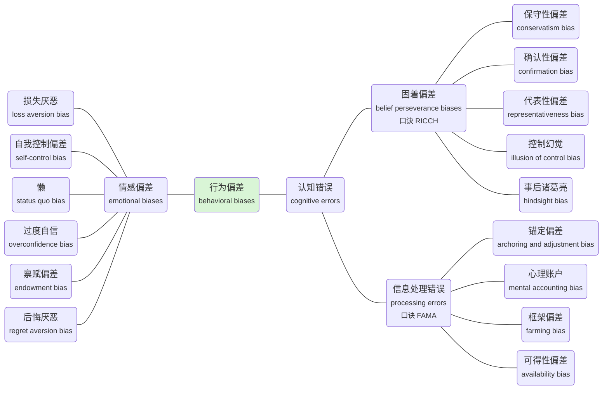

组合 (Portfolio Management, 投资组合管理) 学习笔记

<!-- more -->

## 现代投资组合理论

### 单个资产的收益和风险

Measurements of **return**

- 预期回报 (**expected return**): the **estimated return** required by investors, so it is an **ex-anti** 事前 measure
- 历史回报 (**historical return**): the **actual return** that was earned by investors, so it is an **ex-post** 事后 measure

Measurements of **risk**

- Variance & standard deviation

### 投资者的风险偏好

风险厌恶型 (**risk averase**, **low risk tolerance**)

- Investors prefer **less risk** given certain expected return
- Maximize return + **minimize risk**

风险中性 (**risk neutral**)

- Investors are **indifferent with the risk**
- Maximize return **only**

风险追逐型 (**risk seeking**, **high risk tolerance**)

- Investors get **extra "utility" from the uncertainty**
- Maximize return + **maximize risk**

通常假设“理性人”为风险厌恶型

### 效用函数

效用函数 (**utility function**): the relative satisfaction that an investor drives from different investment portfolios

$$ U = E(R) - 0.5 \times A \times \sigma^2 $$

- **A > 0**, when investor is **risk-averse**
- **A = 0**, when investor is **risk-neutral**
- **A < 0**, when investor is **risk-seeking**

效用函数这个公式属于约定俗成，无实际意义解释

### 无差异曲线

无差异曲线 (**indifference curve**): plots the combinations of risk-return pairs that an investor would accept to **maintain a given level of utility**

For a **risk-averse** investor: The curves are **upward sloping** and **convex** because of **diminishing marginal utility of return** (边际效应递减)

As risk increases, an investor needs greater return to compensate for higher risk **at an increasing rate**

### 投资组合的收益和风险

投资组合的收益

$$ E(R_p) = w_1R_1 + w_2R_2 $$

投资组合的风险

$$ \sigma^2_P = w^2_1 \sigma^2_1 + w^2_2 \sigma^2_2 + 2w_1w_2\text{Cov}(R_1, R_2) = w^2_1 \sigma^2_1 + w^2_2 \sigma^2_2 + 2w_1w_2\sigma_1\sigma_2\rho_{1,2} $$

当 $\rho = 1$ 时 (**perfectly positive correlated**, 完全正相关)

$$ \sigma_P = w_1\sigma_1 + w_2\sigma_2 $$

当 $\rho < 1$ 时 (**less perfectly correlated**)

$$ \sigma_P < w_1\sigma_1 + w_2\sigma_2 $$

当 $\rho = -1$ 时 (**perfectly negative correlated**, 完全负相关)

$$ \sigma_P = | w_1\sigma_1 - w_2\sigma_2 | $$

### 马科维茨有效前沿

最小方差前沿 (**minimum-variance frontier** of risky assets)

全局方差最小点 (**global minimum-variance point**)

有效前沿 (**efficient frontier** of risky assets): portfolios above efficient frontier is **not achievable**, and portfolios below efficient frontier is **inefficient**

有效前沿未考虑无风险资产

### 有效前沿上的最优投资组合

**Optimal portfolio along efficient frontier**

Investor (A=4) should choose portfolio "X", the **tangent point** of indifference curve to efficient frontier

最优投资组合为有效前沿与无差异曲线的切点

**Less risk-averse investor (A=2)** will select portfolio "Y" (**more in risky asset**)

### 资本配置线CAL

资本配置线 (**capital allocation line**): the portfolios available to an investor through **combining the risk-free asset with one risky asset**

$$ E(R_P) = w_AR_A + w_fr_f $$

$$ \sigma_P = w_A\sigma_A $$

$$ \text{CAL:} \quad E(R_P) = r_f + \frac{R_A - r_f}{\sigma_A} \sigma_P $$

夏普比率 (**Sharpe ratio**): CAL的斜率

CALC should be selected because it provides the **highest utility** among these three CALs

The **Sharpe ratio** of CAL is the highest

### 最优资本配置线和最优投资组合

Investor should choose "Y" as the **optimal risky portfolio** 最佳风险投资组合 , which will be combined with risk-free asset

This CAL is the **optimal CAL** 最优资本配置线 among all

Portfolio "P" is the **optimal investor portfolio** 最优投资组合

### 资本市场线CML

All investors have **identical efficient frontier** and **identical optimal risky portfolio**, which is the **market portfolio** (M, 市场组合)

Assuming all investors have a **homogeneous expectation** (理性人, 预期完全一致)

资本市场线 (**capital market line**, **CML**): a special CAL that includes all possible combinations of rf asset and market portfolio

$$ \text{CML:} \quad E(R_P) = r_f + \frac{R_M - r_f}{\sigma_M} \sigma_P $$

### 系统性风险与非系统性风险

系统性风险 (**systematic risk**): the risk affects the entire market or economy, which **cannot be avoided** and is inherent in the overall market

- Caused by **macro factors** 宏观因素: interest rates, exchange risk, policy risk, etc.
- Measured by Beta ( $\beta$ ) of the asset, which is **a measure of systematic risk** of an asset, representing **how sensitive an asset's return is to the market as a whole**

$$ \beta_i = \frac{\text{Cov}(R_i, R_m)}{\sigma^2_m} = \rho_{i, m} \times \frac{\sigma_i}{\sigma_m} $$

$$ \beta_\text{portfolio} = \sum_{i=1}^n w_i \beta_i $$

非系统性风险 (**unsystematic risk**): the **risk can be reduced or eliminated** by holding well-diversified portfolios

- Because diversification is cost-free, investors are **only rewarded for taking systemic risks**
- In efficient market, **only systemic risks should be priced**
- 分散可以消除非系统性风险，承担非系统性风险不能提高必要回报率
- 通常20～30个个股，认为已经足够分散

### 因子模型

**return generating model**

多因子模型 (**multi-factor model**)

$$ E(R_i) - r_f = \beta_{i, 1} \times E(\text{Factor 1}) + \beta_{i, 2} \times E(\text{Factor 2}) + \cdots + \beta_{i, m} \times E(\text{Factor m})$$

其中 $\beta_{i, k}$ 是 **the sensitivity of excess return** on risk factor k

常见的因子包括

- 宏观经济因子 (**macroeconomic factors**): e.g. GDP growth, inflation, consumer confidence
- 基本面因子 (**fundamental factors**): e.g. earnings, earnings growth, firm size, research expenditures
- 统计因子 (**statistical factors**): e.g. **may or may not** have an economic or fundamental connection to returns

单因子模型 (**single-index model**)

$$ E(R_i) - r_f = \beta_i \times E(\text{market risk premium}) \quad =  \beta_i \times [E(R_M) - r_f] $$

其中，**market risk premium** 表示市场风险溢价

**Market model**

$$ R_i = \alpha_i + \beta_i \times R_m + e_i $$

注意这里是Ri，不是超额回报

证券特征线 (**Security Characteristic Line**, **SCL**)

### 资本资产定价模型CAPM的前提假定

- Investors are **risk averse**, **utility-maximizing**, **rational** individuals 理性人，风险厌恶，效应最大化
- Investor plan for the **same single holding period** 单一期限
- Investor have **homogeneous** expectations or beliefs 预期一致
- Investors are **price takers** 价格接受者，没有操纵市场
- All investments are **infinitely divisible** 无限可分
- Markets are **frictionless**, including no additional cost and no taxes 无摩擦，无额外成本（交易成本，税费），有融资成本（为无风险利率）

### 资本资产定价模型CAPM

资本资产定价模型 (**Capital Asset Pricing Model**, **CAРM**)

$$ E(R_i) = r_f + \beta_i \times [E(R_M) - r_f] $$

- The expected return is **only measured by beta** (**systematic risk**)
- Used for **assets valuation** by investors and **capital budgeting** 判断高估还是低估

可以推导出 $\beta$ 为超额回报的比值， $\rho$ 为夏普比率的比值

$$ \beta_i = \frac{E(R_i) - r_f}{E(R_m) - r_f} $$

$$ \rho_{i,m} = \frac{\text{SR}_i}{\text{SR}_m} $$

做题注意题目给出的是 market risk premium 还是 market return

### 证券市场线SML

证券市场线 (**security market line**, **SML**): the **graphical representation of CAPM** with beta on the x-axis and expected return on the y-axis

Intercept is $r_f$, slope is the market risk premium $R_m - r_f$

- Any asset or portfolio that are **properly priced** plots **on** SML
- Any asset or portfolio that are **overpriced** plots **below** SML
- Any asset or portfolio that are **underpriced** plots **above** SML

高估的在线下面，低估的在线上面

### SML与CML的比较

### 投资业绩评价指标

阿尔法指标 (**Jensen's alpha**): 代表超额回报，即回报减去CAPM模型的估值

$$ \alpha_P = R_P - [r_f + \beta_i \times (E(R_M) - r_f)]$$

特雷诺比率 (**Treynor ratio**)

$$ \text{Treynor ratio} = \frac{R_P - r_f}{\beta_P}$$

M方 (**M2**)

$$ M^2 = (R_P - r_f) \times \frac{\sigma_M}{\sigma_P} + r_f \quad = r_f + \text{SR}_P \times \sigma_M $$

M方阿尔法 M方 (**M2 Alpha**)

$$ M^2 \text{Alpha} = M^2 - R_M $$

夏普比率 (**Sharpe ratio**)

$$ \text{SR}_P = \frac{R_P - r_f}{\sigma_p} $$

实际上由于P不能超过CML，所以 $M^2 \text{Alpha} $ 永远是负数

对存在非系统性风险的投资组合，应当使用与CML相关的评价指标；对于已经分散风险的投资组合，可以使用与SML相关的评价指标

会考察定量计算，公式要记住

## 投资组合管理概览

### 投资组合的作用

投资组合 (**portfolio**): a group of financial assets such as stocks, bonds, and cash equivalents,
as well as the mutual, exchange-traded funds, etc.

分散化 (**portfolio diversification**): offer equivalent expected returns **with lower overall volatility of returns**, which helps investors avoid disastrous investment outcomes

Portfolio approach to investing: evaluating individual securities in relation to **their contribution** to the risk and return of the whole portfolio

### 组合管理的步骤

计划阶段 (**planning**)

- Understanding clients' needs
- Developing the **investment policy statement** (**IPS**)

执行阶段 (**execution**)

- **Asset allocation** 资产配置 
- Security analysis
- Portfolio construction

反馈阶段 (**feedback**)

- **Portfolio monitoring** and **rebalancing**
- **Performance measurement** and **reporting**

要背，会考每一步在哪个阶段

### 投资者的类型

个人投资者 (**individual investor**)

- 个人 (**individuals**)
- 设定提存计划 (**defined contribution pension plan**)
    - Individuals make specified contributions to pension plan
    - The benefits are not guaranteed
    - **Individuals accept the investment risk and rewards**

机构投资者 (**institutional investor**)

- 设定受益计划 (**defined benefit pension plan**)
- 基金会 (**endowments & foundations**)
- 银行 (**banks**)
- 保险公司 (**insurance companies**)
    - 寿险 (**life insurance**)
    - 财产险和意外险 (**property and casualty insurance**)

其中，银行、财产险、意外险为投资期限短、流动性要求高、风险承受力低

### 共同基金

开放式共同基金 (**open-end mutual funds**)

- Investors can buy and redeem the mutual fund shares **at net asset value** (**NAV**) 随时按基金净值申购赎回
- 同一交易日只有一个基金净值
- **Not fully invested** as some cash kept for redemption 现金拖累 (cash drag)

封闭式共同基金 (**closed-end mutual funds**)

- No new investments are accepted
- **Could be fully invested**
- Traded at a **premium or discount** to net asset value 以折价或溢价转让

### 交易所交易基金

交易所交易基金 (**exchange-traded funds**, **ETFs**): can be bought and redeemed, or it can trade its share in the secondary market

- Investors can buy and redeem **with a basket of shares** 一揽子股票
- Trading prices are **close to the net asset value** of the fund 折价溢价不会很大
- ETFs are often having **tax advantages** over index mutual funds 避税
- **Transaction costs** are **lower** compared to mutual funds 交易成本低

### 资管行业简介

An **asset manager** is commonly referred to as a **buy-side firm**, while a **sell-side firm** is a **broker/dealer**

基金公司等被称为买方，投顾（代理人）是卖方

**Active management**: eg. smart beta strategies 赚取绝对收益 $ \alpha $

**Passive management**: replicate the returns of a market index 贴合市场指数 $ \beta = 1 $

**Traditional management**: eg. long-only equity and fixed-income securities (Asset-based management fees)

**Alternative management**: eg. hedge fund, private equity, venture capital strategies (Both management and **performance fees**)

Key trends in the asset management industry

- Growth of passive investing
- "Big data" in the investment process
- Robo-advisers in the wealth management industry

### 投资策略声明IPS

Major components of **investment policy statement** (**IPS**)

1. Introduction: describes the client
2. Statement of purpose
3. Statement of duties and responsibilities
4. Procedures
5. Investment **objectives** (**RR**)
    1. **Return** objectives: **absolute** return objectives vs. **relative** return objectives
    2. **Risk** objectives (risk tolerance): **absolute** risk objectives vs. **relative** risk objectives
        - **ability** to bear risk vs. **willingness** to bear risk
6. Investment **constraints** (**TTLLU**)
    1. **Time** horizon
    2. **Tax** concerns
    3. **Liquidity**: the potential need for cash
    4. **Legal** and regulatory
    5. **Unique** needs and preferences
7. Investment guidelines: execution policy and assets that are allowed to invest
8. Evaluation and review
9. **Appendices**: eg. **strategic asset allocation** (**SAA**), **rebalancing policy**

The **benchmark** should be specified in IPS for evaluation

IPS should be **reviewed regularly**

### 资产配置

战略资产配置 (**strategic asset allocation**, **SAA**): use objectives and constraints from IPS and **long-term capital market expectations** to select an optimal portfolio

Specifications of **asset classes**

- Correlations of returns of assets **within an asset class** should be relatively high
- Correlations of returns **between asset classes** should below

战术资产配置 (**tactical asset allocation**, **TAA**): **deviations from SAA** according to **short-term market expectation**, and security selection as permitted and appropriate

### 构建资产组合的基本步骤

1. Use risk, return, and correlations among asset classes to **construct an efficient frontier**
2. **Strategic asset allocation** 战略
3. **Tactical asset allocation** 战术, and **security selection** as permitted and appropriate
4. **Risk budgeting**

### ESG考量

环境 **Environmental** issues: carbon emissions, air pollution, biodiversity, etc.

社会 **Social** issues: labor standards, human rights, community relations, etc.

公司治理 **Governance** issues: board composition, bribery & corruption, executive compensation, etc.

### 基于ESG的投资组合管理

黑名单 **Negative screening** (**exclusionary screening**): excluding companies or sectors that do not meet client standards

白名单 **Positive screening**

行业内排名靠前 **Best-in-class**: identifying companies or sectors that rank most favorably with clients

积极股东策略 **Active ownership** 行使股东权利影响公司行为

影响力投资 **Impact investing**

主题投资 **Thematic investing**: focusing on business themes or specific goals

**ESG integration**: integrating the ESG considerations with traditional security and industry analysis

## 个人行为偏差

### 行为偏差的分类

**Behavioral biases** come in two forms, and both forms of bias may cause decisions to **deviate from** what is **assumed by traditional finance theory**

认知错误相对比较容易克服

### 认知错误

保守性偏差 (**conservatism bias**): people maintain their prior views or forecasts by **inadequately incorporating new**, conflicting information 对新信息不重视、视而不见

确认性偏差 (**confirmation bias**): tendency to notice what confirms prior beliefs and to **ignore whatever contradicts** them 加深原有印象，选择性忽略矛盾

代表性偏差 (**representativeness bias**): tendency to classify new information **based on past experiences and classifications**

- **base-rate neglect** 对基率的误判
- **sample-size neglect** 对样本数量的误判

控制幻觉 (**illusion of control bias**): people believe that they can **control or influence outcomes**

事后诸葛亮 (**hindsight bias**): people tend to believe **past events** as having been **predictable** and reasonable to expect

锚定偏差 (**anchoring and adjustment bias**): people tend to **rely on an initial piece of information** to make subsequent estimates and decisions 不自觉参考锚定数字

心理账户 (**mental accounting bias**): people tend to mentally divide money into "accounts" that influence decisions 资金来源影响决策

框架偏差 (**framing bias**): people tend to answer a question differently **based on the way in which it is asked or framed** 感受与表述方式相关，例如屡败屡战vs屡战屡败

可得性偏差 (**availability bias**): people tend to estimate the probability of an outcome based on **how easily information is recalled** 只收集容易获得的信息后作出决策

### 情感偏差

损失厌恶 (**loss-aversion bias**): tendency to strongly prefer **avoiding losses** to achieving gains 注意其与风险厌恶不同

过度自信 (**overconfidence bias**): people demonstrate unwarranted faith in their own abilities

It will be intensified when combined with **self-attribution bias** 自我归因, in which people take too much credit for successes and assign responsibility to others for failures

自我控制偏差 (**self-control bias**): people fail to act in pursuit of their long-term, overarching goals because of **lack of self-discipline** 缺乏自控力

懒 (**status quo bias**): people choose to **do nothing** instead of making a change

禀赋偏差 (**endowment bias**): people **value an asset more** when they own it than when they do not

后悔厌恶 (**regret-aversion bias**): people tend to **avoid making decisions** out of fear that the decision will turnout poorly, **herding behavior**

### 行为偏差对市场的影响

**Anomalies** are apparent **deviations from the efficient market hypothesis**, identified by **persistent abnormal returns** that differ from zero and are **predictable in direction**

**Not** every deviation is anomalous, and misclassifications tend to stem from three sources:

- Choice of asset pricing model
- Statistical issues
- Temporary disequilibria

惯性效应 (**momentum**): future price behavior correlates positively with that of the recent past

泡沫 (**bubbles and crashes**): investors exhibit symptoms of overconfidence and over-trading

价值类股票 **Value stocks** are typically with low price-to-earnings ratios, high book-to-market equity

The value stocks historically **outperformed** growth stock (价值股比成长股表现好), which could be explained by:

- The **halo effect** 聚光灯效应, a company with a good growth record might be seen as a good investment, which is a form of representativeness
- **Home bias** can also be involved in predicting growth rates, leading growth stocks to be overvalued 倾向于买熟悉市场的股票

## 风险管理基础

### 风险管理框架

风险管理框架 (**risk management framework**)

基建 (**risk infrastructure**): the **people** and **systems** required to track risk exposures and perform the quantitative risk analysis to assess the organization's risk profile

风险治理 (**risk governance**): the **top-down process** and guidance that directs risk management activities to the **overall enterprise**

### 全面风险管理

全面风险管理 (**enterprise risk management**): provides an **enterprise-view** of risk management, and focus risk activities on the **entire organization**

风险容忍度 (**risk tolerance**, **risk appetite**): serves as the high-level guidance for management in its strategic selection of risks

风险预算 (**risk budgeting**): **bridging** from the high-level governance risk decision to the many management decisions

### 风险识别

金融风险 (**financial risk**)

- 市场风险 (**market risk**): risks that arise from movements in interest rates, stock prices, exchange rates, and commodity prices
- 信用风险 (**credit risk**): risk of loss if one party fails to pay that owed to another party
- 流动性风险 (**liquidity risk**): risk that cannot be quickly liquidated at fair value

非金融风险 (**non-financial risk**)

- 模型风险 (**model risk**): the risk of a valuation error from improperly using a model
- 尾部风险 (**tail risk**): the probability of extreme losses is higher than predicted
- 操作风险 (**operational risk**): risk that arises from the people and processes
- 偿付能力风险(**solvency risk**): the entity does not survive or succeed because it runs out of cash
- 结算风险 (**settlement risk**)
- 法律风险 (**legal risk**)
- 合规风险 (**compliance risk**)

**Interactions of risks**: risks do not usually arise independently, but generally interact with one another 风险之间是交织在一起

### 风险计量

Measurement of market risk

- Probability
- Standard deviation
- Beta
- **Sensitivity** (delta, gamma, duration)
- **Value at Risk** (**VaR**, 在险价值) & Conditional VaR (CVaR)
    - VaR is a measure of the **maximum** (**minimum**) amount of loss expected for a given period at a given **confidence** (**significance**) level
- Extreme value theory (EVT)
- Scenario analysis and stress testing

Measurement of credit risk

- **Credit rating**
- Solvency ratios
- Profitability ratios
- Leverage measures
- Credit VaR
- Probability of default,
- Expected loss given default
- Ex-ante risk cost

### 风险处置

Methods of risk modification

- Risk **prevention** and **avoidance**
- Risk **acceptance**: self-insurance and diversification
- Risk **transfer**
- Risk **shifting** (例如对冲)

Factor considered in choosing the methods

**Trade-off** between costs and benefits

