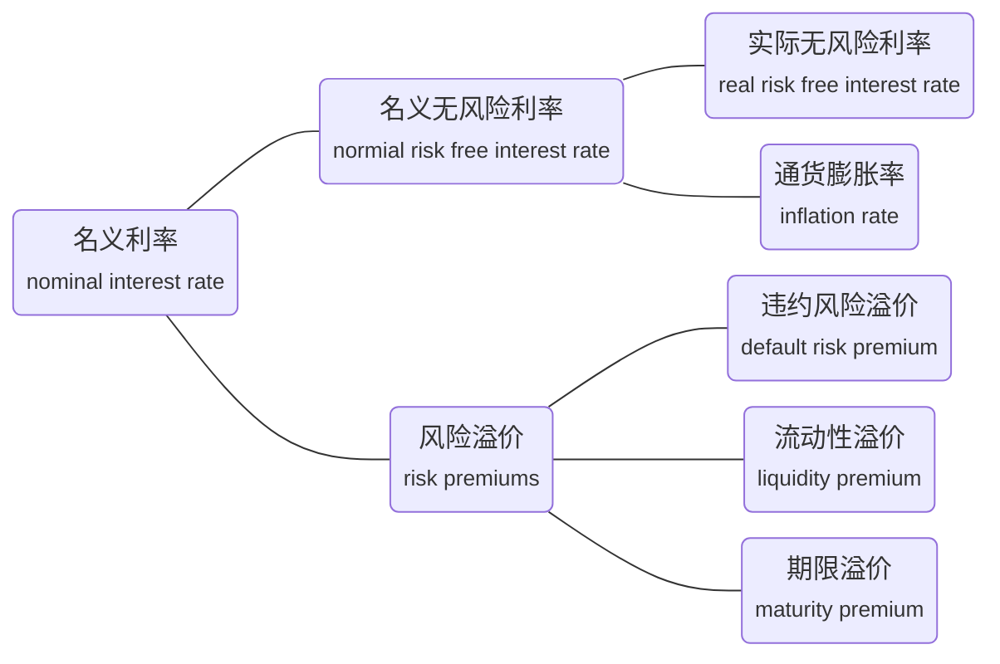
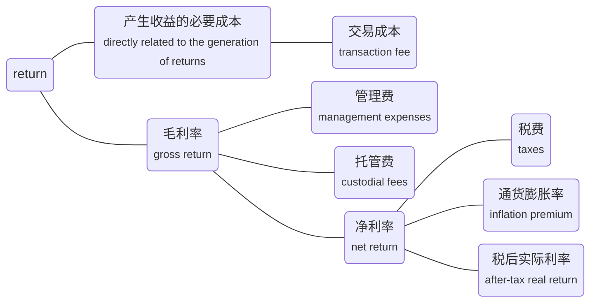

数量（Quantitative Methods，定量分析方法）学习笔记

<!-- more -->

有很多公式，但不用死记硬背，定性比定量更重要

## 利率和投资回报率

### 利率的理解

利率的本质：**货币的时间价值** the rate which is charged or paid for the use of money

利率的应用场景

- 必要回报率 (**required rate of return**): minimum rate of return an investor must receive in order to accept the investment
- 折现率 (**discounted rate**): the rate at which we discount the future amounts
- 机会成本 (**opportunity cost**): the value that investors forgo by choosing a particular course of action

### 利率的组成

### 持有期间回报率

**HPR** (Holding period return) is the return for a single specified period of time.

$$ \text{HPR} = (P_\text{end} - P_\text{begin} + \text{Income}_\text{end}) / P_\text{begin} $$
$$ R_\text{total} = (1+\text{HPR}_1) (1+\text{HPR}_2) \cdots (1+\text{HPR}_n) - 1 $$

### 平均回报率

算数平均回报率 (**Arithmetic mean return**) （计算单利）

$$ R_\text{arithmetic} = (R_1 + R_2 + \cdots + R_n)/n $$

几何平均回报率 (**Geometic mean return**) （计算复利）

$$ R_\text{geometric} = \sqrt[n]{(1+R_1) (1+R_2) \cdots (1+R_n)} - 1 $$

调和平均回报率 (**Harmonic mean return**) （计算平均成本）

$$ R_\text{harmonic} = n / (\frac{1}{R_1} + \frac{1}{R_2} + \cdots + \frac{1}{R_n}) $$

调和平均数 ≤ 几何平均数 ≤ 算数平均数

等号仅在所有元素相等时成立；数据离散程度越大，平均数之间的差异越大

### 时间加权回报率和货币回报率

时间加权回报率 (**TWR**, Time-Weighted Return) （计算开放基金经理业绩）

$$ \text{TWR} = \sqrt[n]{(1+\text{HPR}_1)(1+\text{HPR}_2)\cdots(1+\text{HPR}_n)} - 1 $$

注意：TWR中子期间的划分依据是现金流入流出的时间点，几个子期间长度不必相等。本质是站在复利的角度，几个持有期间的几何平均

货币加权回报率 (**MWR**, Money-Weighted Return)  又称内部回报率、隐藏回报率 (**IRR**) （计算投资者实际收益）

$$ \text{CF}_0 + \text{CF}_1 / (1+\text{MWR})^1 + \cdots + \text{CF}_n / (1+\text{MWR})^n = 0 $$

注意：MWR中子期间长度必须相等。会收到现金流入流出影响。

### 现值和终值因子

期间利率 = 报价年化利率(rs) / 复利频率

periodic interest rate = **quoted interest rate** (**rs**) / compounded frequency (m)

终值因子: future value factor
现值因子: present value factor

$$ \text{FV}_N = \text{PV} \times (1+r_s/m)^{m \times N} $$
$$ \text{PV}_N = \text{FV} \times (1+r_s/m)^{-m \times N} $$

### 年化收益率

有效年利率 (**EAR**, Effective Annual Rate)

$$ \text{R}_\text{annual} = (1 + \text{R}_\text{period})^m - 1 = (1 + r_s/m)^m - 1 $$

### 连续复利模式

连续复利模式 (**Continuously compounded**)

$$ \text{R}^c_\text{annual} = e^{r_s} - 1 $$
$$ \text{FV}_\text{N} = \text{PV}_0 \times e^{r_s \times N} $$
$$ \text{r}^c_{t, t+1} = ln(P_{t+1}/P_t) = ln(1+\text{HPR}_{t, t+1}) $$
$$ \text{r}^c_{0, T} = \text{r}^c_{0, 1} + \text{r}^c_{1, 2} + \cdots + \text{r}^c_{T-1, T} $$

### 各类回报率

- 毛利率 (**Gross Return**): the return before deducting management expenses, custodial fees and taxes
- 净利率 (**Net Return**): the return after deducting all fees and expenses
- 税后实际利率 (**After-Tax Real Return**)
- 杠杆回报率 (**Leveraged Return**): Via derivatives or borrowing, a leveraged position can be created, which may magnify the gains and losses

$$ R_L = r + V_B / V_C \times (r - r_B) $$

## 描述性统计

### 统计学的基本概念

描述性统计 (**descriptive statistics**): a study of how data can be summairized effectively to describe the important aspects of data sets

- 中心趋势 (**central tendency**): where data are centered
- 离散程度 (**dispersion**): how far data are dispersed from their center, usually used to address the **risk**
- 协方差 (**covariance**) 和相关系数 (**correlation**): how two variables move together
- 偏度 (**skewness**): whether the distribution of data is **symmetrically shaped**
- 峰度 (**kurtosis**): whether extreme outcomes are likey or whether **fatty tails** (肥尾) exist

推断统计 (**inferential statistics**): making forecasts, estimates, or judgments about a larger goup from the smaller group actually observed

- 总体 (**population**): includes all members of a specified group
- 总体参数 (**parameter**): the descriptive measure of a population characteristic
- 样本 (**sample**): a subset of a population
- 样本统计量 (**sample statistic**): a descriptive measure of a sample characteristic 

### 均值

总体算数平均数 population arithmetic mean

$$ \mu = \frac{\sum_{i=1}^N X_i}{N} $$

样本算数平均数 sample arithmetic mean

$$ \bar{X} = \frac{\sum_{i=1}^{n} x_i}{n} $$

优点：易于计算；能够用到数据集中的所有信息
缺点：容易收到极端值的影响

对极端值的处理方法

- 数值变形 **transforming the variable** (e.g. a log transformation)
- 选取另一组抽样 **selecting another variable** that achieves the same purpose
- 不做任何事情 **do nothing**, use the data without any adjustment
- 截尾 **delete** all the outliers, calculate **trimmed mean**
- 缩尾 **replace** the outliers with another value, calculate **winsorized mean**

加权平均值 weighted mean

几何平均值 geometric mean

调和平均值 harmonic mean

### 中位数和众数

中位数 (**median**): the value of the middle item of a set of ascending or descending order

优点：不受极端值影响 not affected by extreme values (outliers)
缺点：只用到了一个或两个数据点的信息 only one or two numbers considered, rest is to be ignored

众数 (**mode**): the most frequently occurring value of the distribution

The distribution could have one mode (**unimodal**), more than one mode (**bimodal**, **trimodal**, etc.), or even **no mode**

### 分位数

分位数 (**quantile**): a value at or below which a stated fraction of the data lies

四分位数 (**quartiles**)
四分位距 (**interquartile range**) **IQR** = Q3 - Q1

五分位数 (**quintiles**)

十分位数 (**deciles**)

百分位数 (**percentiles**)
计算百分位数：Ly为第y个百分位数的坐标（坐标从1计数）

$$ L_y = (n+1) \times y / 100 $$

其中n为数据点个数，y为计算第y个百分位，点数据点按照升序排序

箱线图 (**box and whisker plot**)

### 绝对离散程度

离散程度 (**dispersion**): the variability around the central tendency. If mean return addresses reward, then dispersion addresses **risk** and **uncertainty**

极差 (**range**) = maximum value - minimum value

平均绝对离差 (**mean absolute deviation**, **MAD**)

$$ \text{MAD} = \frac{\sum_{i=1}^n|X_i-\bar{X}|}{n} $$

方差 (**variance**):  the average of the squared deviations around the mean

总体方差 population variance

$$ \sigma^2 = \frac{\sum_{i=1}^N(X_i - \mu^2)}{N} $$

样本方差 sample variance

$$ s^2 = \frac{\sum_{i=1}^n(x_i - \bar{x})^2}{n-1} $$

标准差 (**standard deviation**)
总体标准差 (population standard deviation)
样本标准差 (sample standard deviation)

目标下行标准差 (**target downside deviation**, **target semi-deviation**): a measure of dispersion **below the target**

$$ s_\text{target} = \sqrt{\frac{\sum_{\text{all} x_i \le b}(x_i - B)^2}{n-1}} $$

### 相对离散程度

变异系数 (**coefficient of variation**, **CV**): the ratio of the standard deviation of a set of
observations to their mean value

$$ \text{CV} = \sigma / \mu = s / \bar{x} $$

It means the amount of risk (standard deviation) per unit of reward (mean return).

It has no units of measurement, sso permits direct comparisons of dispersions across different data sets.

### 散点图

散点图 (**scatter plot**): for displaying and understanding potential relationships between two variables

Tight (loose) clustering signals a potentially stronger (weaker)
**relationship** between the two variables

Scatter plots are a powerful tool for finding patterns between two
variables, for assessing **data range**, and for **spotting extreme values**

### 协方差

协方差 (**covariance**): a measure of how two pair variables move together

总体协方差 (population covariance)

$$ \text{Cov}(X, Y) = 1/N \times \sum_{i=1}^N [(X_i - \mu_X)(Y_i - \mu_Y)] $$

样本协方差 (sample covariance)

$$ s_{XY} = 1/(n-1) \times \sum_{i=1}^n [(x_i - \bar{x})(y_i - \bar{y})] $$

协方差指示了两个变量的**线性**关系

- Positive covariance shows two variables **tend to** increase or decrease at same time
- Negative covariance shows one variable **tend to** increase when the other decreases
- Zero covariance means no **linear** relationship between two variables

自协方差 (**autocovariance**) is equal to the variance

Covariance values range from negative infinity to positive infinity

### 相关系数

相关系数 (**correlation coefficient**): a standardized (normalized) measure, which expresses
the strength of the linear relationship between two variables

总体相关系数 (population correlation)

$$ \rho_{X,Y} = \sigma_{X, Y} / (\sigma_X\sigma_Y) $$

样本相关系数 (sample correlation)

$$ r_{X,Y} = s_{X, Y} / (s_X s_Y) $$

- range from +1 (**perfect positive correlation**) to -1 (**perfect negative correlation**)
- two variables can have a strong non-**linear** relation and still have a very low correlation
- quite sensitive to **outliers**
- does not imply causation (只负责相关性，不负责因果)

伪相关性 (**spurious correlation**)
- Correlation between two variables that reflects chance relationships in a **particular dataset**
- Correlation induced by a calculation that **mixes** each of two variables with a **third variable**
- Correlation between two variables arising not from a direct **relation**, but from their relation to a **third variable**

### 偏度

偏度 (**skewness**): the degree of symmetry of return distributions

$$ S_k \approx \frac{1}{n} \times \frac{\sum_{i-1}^n (X_i - \bar{X})^3}{s^3} $$

| skewness | meaning | inference |
| :-- | :-- | :-- |
| Sk = 0 | 对称分布 symmetrical distribution | mode = median = mean |
| Sk > 0 | 正偏/右偏 **positively** (**right**) skewed | mode < median < mean 长尾在右边 |
| Sk < 0 | 负偏/左偏 **negatively** (**left**) skewed | mode > median > mean 长尾在左边 |

### 峰度

峰度 (**kurtosis**): the degree to which the **tails** of a distribution relative to the normal distribution

$$ k \approx \frac{1}{n} \times \frac{\sum_{i-1}^n (X_i - \bar{X})^4}{s^4} $$

正态分布的峰度为3

超额峰度 **excess kurtosis** = kurtosis - 3

| kurtosis | excess kurtosis | name | inference |
| :-- | :-- | :-- | :-- |
| kurtosis > 3 | excess kurtosis > 0 | 尖峰态 **leptokurtic** | **fatter tailed** than normal distribution |
| kurtosis = 3 | excess kurtosis = 0 | 中峰态 **mesokurtic** | identical to normal distribution |
| kurtosis < 3 | excess kurtosis < 0 | 低峰态 **platykurtic** | **thinner tailed** than normal distribution |

## 概率论基础

### 随机变量的期望和方差

随机变量 (**random variable**): a quantity whose possible values are uncertain

结果 (**outcomes**): the possible values of a random variable

离散型随机变量 (**discrete random variable**)

连续型随机变量 (**continuous random variable**)

事件 (**event**): a specified set of outcomes

期望 (**expectation**, **expected value** of a random variable): the probability-weighted average of the possible outcomes of the random variable

$$ E(X) = \sum P(X_i) X_i $$

方差 (**variance** of a random variable):the expected value (probability-weighted average) of squared deviations from the random variable's expected value

$$ \sigma^2(X) = E[X - E(X)]^2 = E(X^2) - [E(X)]^2 $$

协方差 (**covariance**): joint probability function

$$ \text{Cov}_{AB} = \sum_i P(R_A=a_i, R_B=b_i) \times [a_i - E(R_A)] \times [b_i - E(R_b)] $$

### 条件概率

非条件概率 (**unconditional probability**) 又称边际概率 (**marginal probability**):  the probability of an event A not conditioned on another event, denoted as P(A)

条件概率 (**conditional probability**): the probability of an event A conditioned on another event B, denoted as P(A|B)

独立事件 (**independent events**): the occurrence of event A does not influence the occurrence of event B

$$ P(A|B) = P(A) $$

联合概率 (**joint probability**): the probability of event A and B both happen, denoted P(AB)

$$ P(AB) = P(B) \times P(A|B) = P(A) \times P(B|A) $$

全概率公式 (**total probability rule**) explains the unconditional probability of the event A in terms of probabilities conditional on the scenarios

$$ P(A) = P(A|S_1) \times P(S_1) + P(A|S_2) \times P(S_2) + \cdots + P(A) = P(A|S_n) \times P(S_n) $$

where S1, S2, ...... Sn are **mutually exclusive** (互斥) and **exhaustive** (遍历)

### 条件期望和条件方差

条件期望 (**conditional expected value**)

$$ E(X|S) = P(x_1|S)x_1 + P(x_2|S) x_2 + \cdots + P(x_N|S) x_N $$

条件方差 (**conditional variance**)

$$ \sigma^2(X|S) = P(x_1|S)[x_1 - E(X|S)]^2 + \cdots + P(x_N|S)[x_N - E(X|S)]^2 $$

全概率公式

$$ E(X) = E(X|S_1)P(S_1) + E(X|S_2)P(S_2) + \cdots + E(X|S_N)P(S_N) $$

### 贝叶斯法则

贝叶斯法则 (**Bayes' formula**): Given a **prior probabilities** 先验概率 P(A) for an event of interest, if receive new information (B), Bayes' formula is the rule used for updating the probability (**updated probability**, **posterior probability**, 后验概率, P(A|B)) of the event

$$ P(A|B) = \frac{P(B|A)}{P(B)} \times P(A) $$

应用1: 调整概率，已知先验概率P(A)，发生了B，求后验概率P(A|B)
应用2: 因果倒置，已知P(B|A)，求P(A|B)

### 投资组合回报率的期望值和方差

投资组合的回报率 (**expected return on the portfolio**)

从整个投资组合的角度理解

$$ E(R_p) = P(r_1)r_1 + P(r_2)r_2 + \cdots + P(r_m)r_m $$

从每个资产的角度理解

$$ E(R_p) = w_1E(R_1) + \cdots + w_nE(R_n) $$

投资组合的方差

$$ \sigma^2(R_p) = E[(R_p - E(R_p))]^2 = \sum_i \sum_j w_i w_j \text{Cov}(R_i, R_j) $$

对于两个资产

$$ \sigma^2_p = w^2_1\sigma^2_1 + w^2_2\sigma^2_2 + 2w^2_1w^2_2\sigma_1\sigma_2\rho_{1,2} $$

对于三个资产

$$ \sigma^2_p = w^2_1\sigma^2_1 + w^2_2\sigma^2_2 + w^2_3\sigma^2_3 + 2w^2_1w^2_2\sigma_1\sigma_2\rho_{1,2} + 2w^2_2w^2_3\sigma_2\sigma_3\rho_{2,3} + 2w^2_1w^2_3\sigma_1\sigma_3\rho_{1,3} $$

### 正态分布

正态分布 (**normal distribution**, **Gaussian distribution**): a **symmetrical**, **bell-shaped** distribution

- plays a central role in the mean-variance model of portfolio selection
- also used extensively in financial risk management
- completely described by two parameters: **mean** and **variance**
- **symmetric** distribution, and its mean, median, and mode are equal
- probabilities decrease further from the mean, but the **tails go on forever**

$$ X \sim N(\mu, \sigma^2) $$

要背下来的数据

| confidence interval | variable range |
| :-- | :-- |
| 68% | $ \mu \pm 1 \sigma $ |
| 90% | $ \mu \pm 1.65 \sigma $ |
| 95% | $ \mu \pm 1.96 \sigma $ |
| 99% | $ \mu \pm 2.58 \sigma $ |

### 标准正态分布

标准正态分布 (**standard normal distribution**, **Z-distribution**): the normal distribution with mean $ \mu = 0 $, and standard deviation $ \sigma = 1 $

$$ Z \sim N(0, 1) $$

标准化 (**standardization**): 假设 $ X \sim N(\mu, \sigma^2) $，则

$$ Z = (X - \mu) / \sigma $$

Z分布表 (**Z-table**)

$$ \Phi(k) = P(X \le k) $$
$$ \Phi(-k) = 1-\Phi(k) $$

### 安全第一比率和亏空风险

亏空风险 (**shortfall risk**): the risk that portfolio value or return will fall below the minimum
acceptable level (**RL**, **shortfall level**, **threshold level**) over some time horizon

安全第一比率 (**safety-first ratio**, **SFRatio**)

$$ \text{SFRatio} = [E(R_p) - R_L] / \sigma_p $$

最大化安全第一比率等价于最小化亏空风险

$$ P(R_p \le R_L) = \Phi (-\text{SFRatio}) $$

### 对数正态分布

对数正态分布 (**lognormal distributed**)

- If $ X $ is normally distributed, then $ e^x $ is lognormal distributed
- If $ Y $ follows a lognormal distribution, then $ \ln Y $ is normally distributed

- 左边界为零 bounded from below by zero
- 正偏 positively skewed

应用：股票价格通认为是对数正态分布，其在连续复利模式下的回报是正态分布的
The stock price may be well described by the lognormal distribution, and a stock's continuously compounded return is normally distributed

### 连续复利模式下的回报率

If continuously compounded returns are **independently** and **identically distributed** (**i.i.d.** 相互独立且服从相同分布)

平方根法则

$$ E(r_{0, T}) = E(r_{0, 1}) + E(r_{1, 2}) + \cdots + E(r_{T-1, T}) = \mu T $$
$$ \sigma^2(r_{0,T}) = \sigma^2T $$
$$ \sigma(r_{0, T}) = \sigma \sqrt{T} $$

### 学生T分布

学生T分布 (**student's T-distribution**): defined by single parameter: **degrees of freedom** (**df**)

- df = n - 1, where n is the sample size
- **symmetrical** (bell shaped), skewness = 0
- **fatter tails** than a normal distribution
- as df increase, T-distribution is approaching to standard normal distribution
- T-distribution has a wider confidence interval than Z-distribution

## 抽样和推断

### 抽样的基本逻辑

抽样误差 (**sampling error**): the difference between the sample statistic (which is a random variable) and the population parameter (which is a constant)

样本统计量的分布 (**sampling distribution**): the distribution of all distinct possible values that the **statistic** can assume when computed from **samples of the same size** randomly drawn from the same population

### 抽样方法

概率抽样 (**probability sampling**): every member of the populatioon has an equal chance being selected, more accuracy and reliability

简单随机抽样 (**simple random sampling**): each element of the popuulation has an equal probability of being selected to the subset, and it is useful for **homogeneous data**

分层随机抽样 (**stratified random sampling**):

1) separate the population into **subpopulations** based on one or more classification criteria
2) use simple random sampling to draw **from each stratum** in sizes proportional to the **relative size** of each stratum in the population and then pooled to form a stratified random sample

系统抽样 (**systematic sampling**):

1) **randomly** pick a member as the starting number
2) select **every k-th** member until reaching the sample size

整群抽样 (**cluster sampling**):

1) divide the population into clusters based on some criteria
2) use simple random sampling to choose certain clusters
3) 一阶段整群抽样 (**one-stage cluster sampling**): all the members in each sampled cluster are included
4) 两阶段整群抽样 (**two-stage cluster sampling**): a subsample is selected from each sampled cluster through random sampling

非概率抽样 (**non-probability sampling**): depends on factors other than probability, and it may generate a **non-representative sample**

便利抽样 (**convenience sampling**)
- selected based on convenience of accessibility
- advantage: time-efficient and cost-effective
- disadvantage: limited level of accuracy

主观抽样 (**judgmental sampling**)
- selected based on a sampler's specialty and professional judgment
- results may be skewed due to the bias of the sampler

### 蒙特卡洛模拟

蒙特卡洛模拟 (**Monte Carlo simulation**): uses randomly generated values for risk factors, based on their assumed distributions, to **produce a distribution of possible outcomes**

- widely used to estimate risk and return investment applications
- often combined with **scenario analysis** 情景分析 or **sensitivity analysis** 敏感性测试
- for valuing complex securities for which **no analytic pricing formula** is available
- a **complement** to analytical methods, and it provides only statistical estimates, not exact results
- in otherwise, analytical methods provide more insight into cause-and-effect relationships

### 重抽样

重抽样 (**resampling**): a computational tool to **repeatedly** draw samples **from the original sample** for the statistical inference of population parameters

自助法 (**bootstrap**):

- repeatedly draws samples from the original sample
- each resample is of **the same size with the original** sample
- the identical element is **put back** into the group so that it can be drawn more than once
- **model-free** (**non-parametric resampling**), and it does not rely on an analytical formula
- a complement to analytical methods, provides only statistical estimates

抽刀法 (**Jackknife**):

- **leave out one observation** from the original sample at one time without replacing it
- usually requires **repetitions equal to the sample size**
- used to reduce the bias
- produce similar results, whereas bootstrap resamples usually have different results

### 中心极限定理

中心极限定理 (**central limit theorem**): given a population described by **any probability distribution** having mean $ µ $ and finite variance $ o^2 $, the sampling distribution of the sample mean $ \bar{X} $ computed from random samples of size $ n $ from this population will be approximately normal with mean $ \mu $ (population mean) and variance $ \sigma^2 / n $ (population variance divided by n) when the sample size $ n $ is large

对于**任意分布**，若存在均值为 $ \mu $ ，方差为 $ \sigma^2 $，对其做规模为 $ n \ge 30 $ 的随机抽样，样本均值 $ \bar{X} $ 渐进服从于 $ N(\mu, \sigma^2/n) $

The central limit theorem helps us understand **the sampling distribution of the sample mean**, and it is used to estimate **how closely** the sample mean can be expected to match the underlying population mean

### 样本均值的标准误

The standard deviation of a sample statistic is known as the **standard error of the statistic**.

当总体方差已知，则样本标准差

$$ \sigma_{\bar{X}} = \sigma / \sqrt{n} $$

若总体标准差未知，则样本标准差

$$ S_{\bar{X}} = s / \sqrt{n} $$

内在逻辑

当总体方差已知，则

$$ \frac{\bar{X} - \mu}{\sigma / \sqrt{n}} \quad \sim N(0, 1)  $$

当总体方差未知，则

$$ \frac{\bar{X} - \mu}{s / \sqrt{n}} \quad \sim T_{(df = n - 1)} \quad \overset{\text{when n is large}}{\sim} N(0, 1) $$

标准差与标准误的区别

- 标准差 standard deviation measures the **dispersion** of the data from the mean
- 标准误 standard error measures how much **inaccuracy** of a population parameter estimate comes from sampling

### 假设检验的基本概念

假设检验 (**hypothesis testing**): an act in statistics whereby an analyst tests an assumption regarding a **population parameter**

决策 (**decisions**): either **reject** the hypothesis, **or not reject** the hypothesis

### 原假设和备择假设

原假设 (**null hypothesis**) (**H0**) are **hypothesis to be tested**

备择假设 (**alternative hypothesis**) (**Ha**) are the **opposite side** of null hypothesis

The null and alternative hypotheses must be **mutually exclusive** 互斥 and **collectively exhaustive** 详尽

双边检验 (**two-tailed test**)

$$ H_0: \theta = \theta_0 \quad \text{vs.} \quad H_a: \theta \ne \theta_0 $$

单边检验 (**one-tailed test**)

$$ H_0: \theta \le \theta_0 \quad \text{vs.} \quad H_a: \theta > \theta_0 $$
$$ H_0: \theta \ge \theta_0 \quad \text{vs.} \quad H_a: \theta < \theta_0 $$

等号永远在原假设里，不会出现在备择假设

期望的场景应当放在备择假设里，因为只有当决策拒绝了原假设时，才具有可信度

### 假设检验的决策依据

样本统计量 (**sample statistic**)

检验统计量 (**test statistic**): 样本统计量变换后、服从标准正态分布的随机变量，例如

$$ \frac{\bar{X} - \mu_0}{\sigma / \sqrt{n}} $$

其中 $\bar{X}$ 为样本统计量，原假设为总体均值等于 $\mu_0$ ，样本大小为 $n$ ， $\sigma$ 为总体标准差

显著性水平 (**significance level**, $ \alpha $): 拒绝域所占概率面积

置信区间 (**confidence level**, $ 1-\alpha $)

If the calculated value of the test statistic is within **rejection region** (**critical region**), then we **reject the null hypothesis**, and we say the result is **statistically significant**

If test statistic's value is outside the range of critical value, reject the null hypothesis

If the P-value < level of significance (x), reject the null hypothesis

**P-value** is the smallest level of significance at which the null hypothesis can be rejected

### 一类错误和二类错误

一类错误 (**type I error**): rejecting null hypothesis when it is true

$$ P(\text{Type I error}) = P(\text{reject null}|\text{the null is true}) = \alpha (\text{level of significance}) $$

置信区间 (**confidence level**)

$$ (1 - \alpha) =  1 – P(\text{Type I Error}) = P(\text{not reject null}|\text{the null is true}) $$

二类错误 (**type II error**): failing to reject the null hypothesis when it is false

$$ P(\text{Type II error}) = P(\text{not reject the null}|\text{the null is false}) = \beta $$

假设检验的势 (**power of test**)

$$ (1 - \beta) = 1 - P(\text{Туpe II Error}) = P(\text{reject the null}|\text{the null is false}) $$

<table>
    <tr>
        <th></th>
        <th>$H_0$为真</th>
        <th>$H_0$为假</th>
    </tr>
    <tr>
    </tr>
        <th>拒绝原假设</th>
        <td>第一类错误, $\alpha$</td>
        <td>势, $1-\beta$</td>
    <tr>
        <th>未拒绝原假设</th>
        <td>置信区间, $1-\alpha$</td>
        <td>第二类错误, $\beta$</td>
    </tr>
</table>

When sample size increases, the probabilities of **both** Type I error and Type II error decrease

### 对单一均值的检验

Test statistic for hypothesis tests of **population mean** with **known variance**

$$ Z = \frac{\bar{X} - \mu_0}{\sigma / \sqrt{n}} \quad \sim N(0, 1) $$

Test statistic for hypothesis tests of **population mean** with **unknown varianc**

$$ T = \frac{\bar{X} - \mu_0}{s / \sqrt{n}} \quad \sim T_{n-1} \quad \overset{\text{when n is large}}{\sim} N(0, 1) $$

### 对多个均值的检验

均值的差：Hypothesis test concerning **difference of means**

- $ H_0: \mu_1 - \mu_2 = d_0 $
- **independent** populations with **variance** unknown but **assumed equal**
- $ T = \frac{(\bar{X_1}-\bar{X_2}) - d_0}{\sqrt{\frac{s_p^2}{n_1} + \frac{s_p^2}{n_2} }} \quad \sim T_{n_1 + n_2 - 2} $
- $ s^2_p = \frac{(n_1-1)s_1^2 + (n_2-1)s_2^2}{n_1+n_2-2} $

差的均值： Hypothesis test concerning the **mean of the differences** (a paired comparisons test)

- $ H_0: \mu_d = d_0 $
- **dependent** populations
- $ T = \frac{\bar{d} - d_0}{s_{\bar{d}}} = \frac{\frac{1}{n} \sum d_i - d_0}{s_d / \sqrt{n}} \quad \sim T_{n-1} $

### 对单一方差的检验

Hypothesis test concerning a **single variance**

- $ H_0: \sigma^2 = \sigma^2_0 $
- $ \chi^2 = \frac{(n-1) \times s^2}{\sigma^2_0} \quad \sim \chi^2_{n-1}$

其中，卡方分布为m个相互独立的标准正态分布的平方和

### 对多个方差的检验

Hypothesis test concerning **equality of two variances**

- $ H_0: \sigma^2_1 = \sigma^2_2 $
- independent populations
- $ F = s^2_1 / s^2_2 \quad \sim F(n_1-1, n_2-1)$

其中，F分布为两个卡方分布除以自由度再相除 $ F = \frac{\chi^2_{(m)} / m}{\chi^2_{(n)} / n} \quad \sim F(m, n)$

通常约定俗成，用方差大的除以方差小的

### 参数检验和非参数检验

参数检验: concerned with **parameters**

The validity depends on a definite set of assumptions - in particular, assumptions about **the distribution of the population** producing the sample

非参数检验: not concerned with a parameter, or makes minimal assumptions about the population from which the sample comes

The parametric test (where available) is generally preferred over the nonparametric test because **the parametric test may have more power** - that is, a greater ability to reject a false null hypothesis

Nonparametric test is applied when:

- Data do not meet **distributional assumptions**
- There are **outliers**
- Data are given **in ranks** or use an **ordinal scale**
- The hypothesis we are addressing does **not concern a parameter**

### 对相关系数的参数检验

皮尔逊相关系数 (**Pearson correlation**): the bivariate correlation, or simply the correlation

- $ \rho_{XY} = \text{Cov}(X, Y) / (\sigma_x \sigma_y) $
- $ H_0: \rho = 0 \quad (\text{or} \enspace H_0: \rho \ge 0 \quad \text{or} \enspace H_0: \rho \le 0) $
- $ T = \frac{r - 0}{\sqrt{\frac{1-r^2}{n-2}}} = \frac{r \times \sqrt{n-2}}{\sqrt{1-r^2}} \quad \sim T_{n-2} $

最后这个公式要背，考过很多次，r为样本相关系数

### 对相关系数的非参数检验

斯皮尔曼秩相关系数 (**Spearman rank correlation coefficient**)

$$ r_s = 1 - \frac{6 \times \sum_{i=1}{n} d_i^2}{n \times (n^2-1)} $$

其中 $ d_i = \text{rank}_{x_i} - \text{rank}_{y_i} $

- 小样本查表: For small samples, the researcher requires a specialized table of critical values
- 大样本参照皮尔逊相关系数: For large samples, we can conduct a t-test with n - 2 degrees of freedom

### 对列联表不同维度关联性的非参数检验

Tests of independence based on **contingency table** data is to test whether the classifications of categorical or discrete data are independent

It is a nonparametric one-tailed chi-square test

$$ \chi^2 = \sum_{i=1}^m \frac{(O_{ij} - E_{ij})^2}{E_{ij}} \quad \sim \chi^2_{(r-1) \times (c-1)} $$

- $m$ is the number of cells in the contingency table ($m = i \times j$)
- $O_{ij}$ is the observed frequency in the $\text{cell}_{(i, j)}$
- $E_{ij}$ is the expected frequency in the $\text{cell}_{(i, j)}$

## 简单线性回归

### 简单线性回归的基本概念

线性回归 (**linear regression**): the linear relationship between dependent and independent variables

因变量、被解释变量 (**dependent variable**, **explained variable**): the variable whose variation is being explained

自变量、解释变量 (**independent variable(s)**, **explanatory variable(s)**): the variable(s) whose variation is (are) being used to explain the variation of the dependent variable

简单线性回归 (**simple linear regression**, **SLR**): only one independent variable

总体回归函数 (**population regression function**)

$$ Y_i = b_0 + b_1X_i + \varepsilon_i $$

- 截距项 (**intercept**): $b_0$
- 斜率项 (**slope coefficient**): $b_1$
- 误差项 (**error term**): $\varepsilon_i \quad E(\varepsilon) = 0$

样本回归函数 (**sample regression function**)

$$ Y_i = \hat{Y_i} + e_i = \hat{b_0} + \hat{b_1}X_i + e_i $$

- 残差项: $ e_i = Y_i - \hat{Y_i} $

### 最小二乘法

最小二乘法 (**ordinary least squares**, **OLS**): sum of the squared vertical distances from the observations to the fitted line is minimized

残差平方和 (**sum of squares error**, **SSE**, residual sum of squares)

$$ \text{SSE} = \sum (Y_i - \hat{Y_i})^2 = \sum[Y_i - (\hat{b_0} + \hat{b_1}X_i)]^2 = \sum e_i^2 $$

斜率项计算

$$ \hat{b_1} = \frac{\text{Cov}(X, Y)}{s^2(X)} = \frac{\sum_{i=1}^n(Y_i-\bar{Y})(X_i-\bar{X})}{\sum_{i=1}^n(X_i-\bar{X})^2} $$

截距项计算

$$ \hat{b_0} = \bar{Y} - \hat{b_1} \times \bar{X} $$

### 简单线性回归的前提假设

假设1 线性相关: The relationship between the dependent variable Y and the independent variable X is **linear**

When we look at the residuals of a model, what we would like to see is that **the residuals are random**, and the independent variable X is not necessarily random

假设2 同方差性(**homoskedasticity**): The **variance of the regression residuals is the same** for all observations

异方差性 (**heteroskedasticity**): the variance of residuals differs across observations

假设3 观测相互独立: the observations, pairs of Y and X, are independent of one another, which implies the regression **residuals are independent** across observations

假设4 残差服从正态分布: the regression residuals are normally distributed

This does not mean that the dependent and independent variables must be normally distributed

### 方差分析表

Analysis of Variance Table for Simple Linear Regression

| Source | Sum of Squares | Degrees of Freedom | Mean Square |
| :-- | :-- | :-- | :-- |
| Regression | $\text{SSR} = \sum_{i=1}^n(\hat{Y_i}-\bar{Y})^2$ | 1 (自变量个数) | MSR = SSR / 1 |
| Error | $\text{SSE} = \sum_{i=1}^n(Y_i - \hat{Y_i})^2$ | n - 2 | MSE = SSE / (n-2) |
| Total | $\text{SST} = \sum_{i=1}^n(Y_i - \bar{Y})^2$ | n - 1 | Var(Y) = SST / (n-1) |

### 拟合优度评价

决定系数 (**coefficient of determination**, **R2**): the percentage of the variation of the dependent variable that is explained by the independent variable

$$ R^2 = \text{SSR} / \text{SST} = 1 - \text{SSE} / \text{SST} $$

- 取值范围 $[0\%, 100\%]$
- 数值越高，regression占比越高
- 在简单线性回归中，决定系数与样本相关系数的平方相等 In a simple linear regression, the **square of the pairwise correlation** is equal to the coefficient of determination

$$ R_2 = r^2 $$

F检验统计量 (**F-statistics**)

$$ F = \text{MSR} / \text{MSE} = \frac{\text{SSR}/1}{\text{SSE}/(n-2)} $$

- $H_0: b_1 = 0 \quad H_1: b_1 \ne 0$ （原假设为线性无关，即所有斜率项均为0）
- 自由度为 (1, n-2)
- 数值越大，regression占比越高，解释力强

估计的标准误 (**standard error of the estimate**)

$S_e = \sqrt{\text{MSE}}$

- 数值越小，regression占比越高

### 对参数的假设检验

对斜率项做假设检验 (hypothesis tests of the **slope coefficient**)

$$ t = \frac{\hat{b_1} - M}{s_{\hat{b_1}}} \quad \sim T_{n-2}$$

其中 $s_{\hat{b_1}}$ 为斜率项对标准误

$$ s_{\hat{b_1}} = \frac{s_e}{\sqrt{\sum_{i=1}^n(X_i - \bar{X})^2}} $$

- 原假设: $H_0: b_1 = M$
- 自变量的离散程度越高，斜率的标准误越小，越容易拒绝原假设 The greater the variability of the independent variable, the lower the standard error of the slope and hence the greater the calculated t-statistic, and the null hypothesis is more likely to be rejected

对相关系数做假设检验 (hypothesis tests of the **correlation**)

$$ t = \frac{r\sqrt{n-2}}{\sqrt{1-r^2}} \quad \sim T_{n-2} $$

- 原假设: $H_0: \rho = 0$
- 对于简单线性回归 $t^2 = F$

对截距项做假设检验 (hypothesis tests of the **intercept**)

$$ t = \frac{\hat{b_0} - N}{s_{\hat{b_0}}} \quad \sim T_{n-2} $$

- 原假设: $H_0: b_0 = N$

### 对预测结果的估计区间

预测的标准误 (**standard error of the forecast**)

$$ s_f = s_e \times \sqrt{1 + \frac{1}{n} + \frac{(X_f - \bar{X})^2}{\sum_{i=1}^n(X_i - \bar{X})^2}} $$

因变量的估计区间 (**prediction interval of dependent variable**)

$$ \bar{Y} \pm t_{\text{critical for }\alpha/2} \times s_f $$

减小预测标准误的条件

- 减小估计标准误: The better the fit of the regression model, the smaller the standard error of the estimate ($S_e$)
- 增大样本规模: The larger the sample size ($n$) in the regression estimation
- 增大自变量离散程度: The larger the variation of the independent variable ($\sum_{i=1}^n(X_i-\bar{X})^2$)
- 让预测自变量更靠近均值: The closer the forecasted independent variable ($X_f$) is to the mean of the independent variable ($\bar{X}$) used in the regression estimation

### 指示变量

指示变量、哑变量 (**indicator variable**, **dummy variable**): an independent variable whose value takes on only 0 or 1

截距项: In a simple linear regression, the interpretation of the intercept ($b_0$) is the predicted value of the dependent variable if the indicator variable is 0

$$b_0 = E(Y)_{X=0} $$

斜率项: The interpretation of the slope ($b_1$) is the difference of the predicted value of the dependent variable if the indicator variable is 0 and 1, respectively

$$b_1 = E(Y)_{X=1} - E(Y)_{X=0} $$

### 对数线性回归模型

**log-lin model**: The slope coefficient b₁ is the relative change in the dependent variable for an absolute change in the independent variable

$$ \ln{Y_i} = b_0 + b_1 X_i + \varepsilon_i $$

**lin-log model**: The slope coefficient b1 provides the absolute change in the dependent variable for a relative change in the independent variable

$$ Y_i = b_0 + b_1 \ln{X_i} + \varepsilon_i $$

**log-log model**: The slope coefficient b₁ is the relative change in the dependent variable for a relative change in the independent variable

$$ \ln{Y_i} = b_0 + b_1 \ln{X_i} + \varepsilon_i $$

## 大数据分析

### 金融科技的基本概念

**Fintech** refers to technological innovation in the design and delivery of financial services and products

Areas of development that are more directly relevant to quantitative analysis in the investment:

1. analysis of large datasets
2. analytical tools

### 大数据的特征

1. 规模 **Volume**: MB -> GB -> TB -> PВ
2. 速度 **Velocity**: batch -> periodic -> real-time or near-real-time
3. 多样化 **Variety**: structured data (e.g. SQL tables), semi-structured data (e.g. HTML), and unstructured data (e.g. videos)
4. 真实性 **Veracity**: credibility and reliability of different data sources

### 大数据的来源

**Traditional data**: stock exchanges, financial statements, economic indicators

**Non-traditional data** (**alternative data**)

- **Individuals**: social media, news, reviews, web searches
- **Business processes**: transaction data, corporate data
- **Sensors**: satellites, geolocation, Internet of Things (物联网)

### 大数据分析面临的挑战与困境

Quality, volume, and appropriateness of the data

Unstructured data are more often qualitative

Artificial intelligence and machine learning techniques have emerged

### 人工智能和机器学习

**Artificial intelligence** (**AI**) enables the development of computer systems that exhibit **cognitive** and **decision-making ability** comparable or superior to that of human beings

**Machine learning** (**ML**) is computer-based techniques that try to extract information from huge amounts of data without making any assumptions on the probability distribution of data

ML involves splitting the dataset into **training** dataset, **validation** dataset and **test** dataset

**Neural networks**: based on brain learns and processes information to detect abnormal charges or claims in credit card fraud detection systems

### 机器学习的分类

**Supervised** learning: learn model relationships based on **labeled** training data

**Unsupervised** learning: computers are **not given labeled** data, entailing the algorithm seeking to describe the data and their structure

**Deep learning** (or deep learning nets): use neural networks, often with **many hidden layers**, to perform multistage, non-linear data processing to identify patterns

### 机器学习存在的问题

ML still **requires human judgment** in understanding the underlying data and selecting the appropriate techniques for data analysis

ML models also require sufficiently **large amounts of data** and might not perform well when not enough available data are available to train and validate the model

**Overfitting** occurs when the model learns the dataset too precisely and **treats noise as true**

**Underfitting** occurs when the model is too simplistic and **treats true parameters as noise**

### 大数据在数据科学中的应用

**Data visualization** refers to how the data will be formatted, displayed, and summarized in graphical form

- Traditional structured data: tables, charts, and trends
- Non-traditional unstructured data: three-dimensional (3D) graphics, **tag cloud**

**Text analytics** is based on analyzing word frequency in a document to help identify future performance, such as consumer sentiment or economic trend

**Natural language processing** (**NLP**) is a field of research at the intersection of computer science, artificial intelligence, and linguistics that focuses on developing computer programs to analyze and interpret human language
