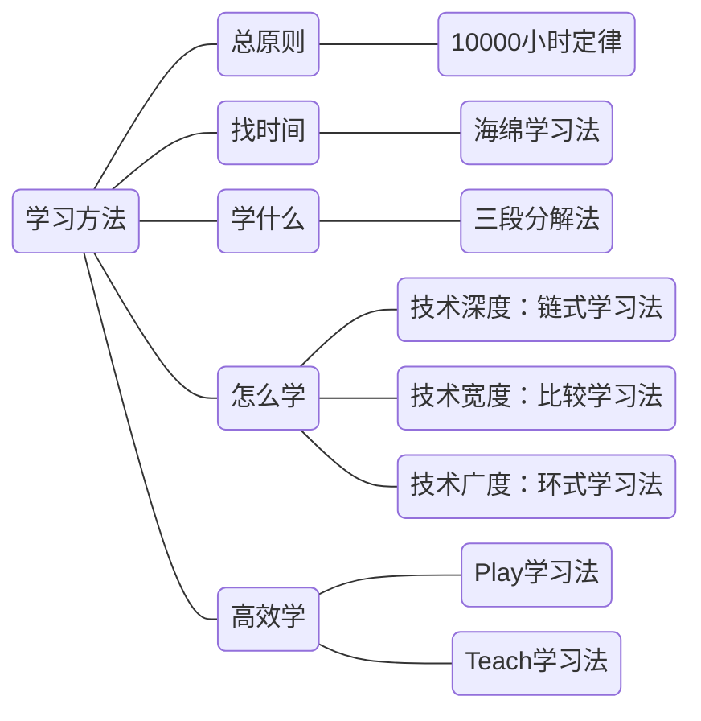
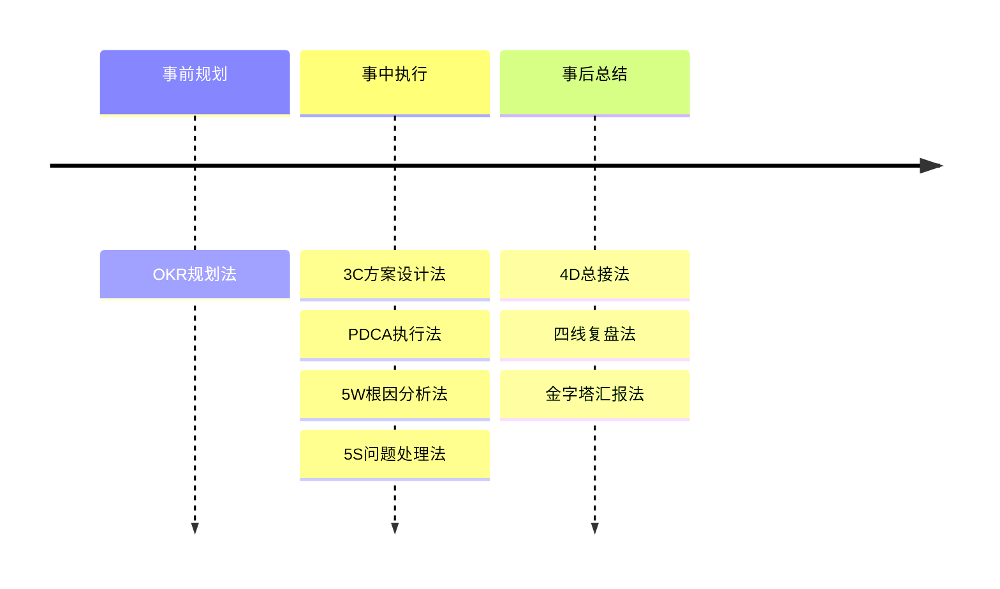
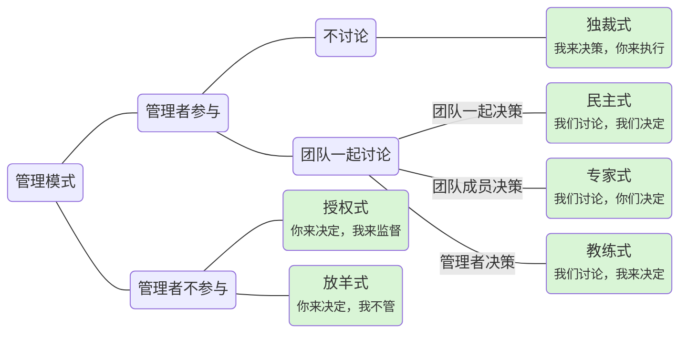

《[大厂晋升指南](https://time.geekbang.org/column/intro/100064501)》学习笔记

<!-- more -->

> 吐槽：我都工作这么多年了，现在看似乎有点晚了hhh

# 开篇词

这门课是怎么设计的

学习方法

- 第一步，先完整地跟着课程的节奏学习一遍，对晋升形成整体的认知。
- 第二步，根据自己当前的情况，按图索骥寻找对应的章节深入学习并实践。
- 第三步，当你有了一定的实践经验之后，再来重新学习对应的章节，做到“知行合一”

# 理解晋升

## 职级体系：你意识到级别鸿沟了吗

不同性质的公司和机构，采用的职级体系差异很大，最常见的有以下两种。

1. 职称体系：标准统一，常见于传统行业
2. 自立体系：灵活操作，常见于互联网行业，不同公司不容易直接对标

通常的设计方式

1. 职级体系划分为专业线和管理线
2. 专业线按照其设计特点又可以划分为两类，那就是**跨越式职级**和**阶梯式职级**，涵盖了从毕业生到业界精英的各个级别。
3. 管理线一般不会再分领域，而且你在专业线达到一定级别后，才能转管理线发展。鼓励员工积累足够的专业技能，而不要变成只会发号施令开会写报告的纯管理者。
4. 专业线和管理线双通道发展的模式，被实践证明存在很多问题，现在已经很少用到了。

跨越式职级 (阿里、字节)

- 相邻两个级别的差异比较大
- 晋级的时候不是简单地要求能力“有提升”就可以了，而是要求有“本质的提升”
- 绝大部分人其实是没有意识到这个级别鸿沟的存在
- 晋升的机会比较少
- 晋级成功对很多人来说就意味着成长停止
- 同级别的回报差异是比较大的

阶梯式职级 (腾讯、华为)

- 两个指标：职级和职等
- 相邻级别差异小
- 晋升机会更多
- 同级别的回报差异不大
- 很难客观地定义和评估两个等级之间的差异
- 当出现跨级晋升的时候，其实还是有“级别鸿沟”的

## 晋升流程：通过多少“关卡”才能晋升

### 晋升流程

1. 提名阶段：主管决定要不要提名你去参加晋升
2. 预审阶段：部门对提名的名单进行预审，如果你跟其他竞争者 PK 失败，就失去了晋升机会
3. 评审阶段：评委团对你进行评审，考察你的能力有没有满足要求
4. 复审阶段：部门对评审结果进行复审，确认你的晋升结果
5. 审批阶段：复审的结果上报高层审批，审批通过之后，你的晋升结果就最终确定了
6. 沟通阶段：主管或 HR 跟你沟通晋升结果

### 提名阶段

硬性条件

1. 绩效条件：绩效至少要达到“正常”水平
2. 年限条件：在当前级别的工作年限必须满足晋升的硬性规定
3. 红线条件：违反某些政策会被取消当年甚至几年之内的晋升资格
4. 附加条件：有的公司为了鼓励员工重视某些事情，可能会将它跟晋升挂钩，最典型的就是专利

软性条件：自己认可+主管认可

- 自己认为能力够了，但主管不认可：请主管给出明确的指导意见，以及后续有针对性的工作安排
- 主管不太好明确判断：要主动提出晋升想法，表达积极进取的意愿和规划

### 预审阶段

- 横向拉通对比
- 防止主管放水，提名太多
- 防止主管之间的能力评价标准相差太远
- 书面预审一般用于 P7 以下级别的晋升，提名材料写得好不好就很关键了
- 会议预审用于 P7 及以上级别的晋升，**各个**主管对你的了解程度就很关键（平时要多social）

### 评审阶段

1. 材料准备：写答辩PPT等
2. 晋升自述：展示亮点
3. 晋升答辩：回答评委问题
4. 能力评价：评委判断
5. 结果确定：综合评委意见

- 最核心的阶段
- 评委团可以通过两种方式来给出评审结果：集体讨论和独立投票
    - 集体讨论可能会有“熟人”问题
    - 独立投票可能会有“隔行如隔山”问题
- 运气因素：**评委团的不确定性**

### 复审阶段

- 部门级的拉通分析
- 通过总体的晋升通过率来判断晋升情况
- 通过率参考指标可能存在“大小年”的现象
    - 运气因素：**公司通过率指标的不确定性**
- 水平处在中间位置的话，可能因为部门通过率调控而被刷下来
    - 运气因素：**部门通过率调控的不确定性**

### 审批阶段

公司层面会对各个部门上报的晋升结果做最终的确认，然后确定薪资涨幅和股权激励之类的方案

### 沟通阶段

主管（有时+HR）会把最终的晋升结果反馈给你

## 晋升原则：什么样的人更容易晋升

### 主动原则：主动做事

两个坏习惯

- 认为主管肯定会帮你搞定晋升
- 被动接收信息

主动做事的人，比等着别人安排的人更容易晋升

第一，要**主动找主管沟通工作**

- 首先，并不是每个主管都会关注组员的成长。主管的做事风格可能有很多种
- 其次，就算主管关注组员的成长，他的判断也有可能跟你的判断不一致
- 定期或者不定期地找他沟通关于工作任务的想法和意愿

第二，我们要**主动找别人沟通**，了解更多信息

### 成长原则：不断挖掘成长点

两个陷阱

- 以为事情做得多，自然就能晋升
- 以为事情做得好，自然就能晋升

边做事一边挖掘成长点、提升自己能力的人，比光顾着做事的人更容易晋升

第一，尝试更**高难度**、**更高复杂度**的事情，而不是一味地刷熟练度

第二，不管事情做好了还是没做好，你都应该**多做复盘总结**，找到可以提升优化的点

### 价值原则：学习为公司产出价值的技能

- 从晋升角度考虑，学习的技能无法**为当前的公司创造价值**，时间其实白白浪费掉了
- 公司设计职级体系的初衷，是为了衡量不同员工的**能力级别**，鼓励员工尽量提升自己的能力，**为公司**产出更大的价值
- 能力级别和公司价值，但是大部分人都只关注了能力级别，而忽略了公司价值这个点
- 在晋升的时候，不论你把能力吹得多么天花乱坠，如果不能体现在**对公司价值的实际产出**上，那一切都是废话
- 有能力为公司产出价值的人，比空有一身能力的人更容易晋升

## 晋升逻辑：判断是否达到晋升要求

一些看似客观的常见做法

- 以当前级别的年限为标准
- 以工作年限为标准
- 以绩效为标准

它们跟能力并没有直接的正相关关系

- 无论什么年限都不是我们判断能力的标准
- 绩效不能等同于能力。绩效关注的是业务结果，晋升关注的是能力提升

### 第一条逻辑：提前做下一级别的事

- 在当前级别做下一级别事情的人，才有机会晋升
- 如果一直只是完成别人安排的项目任务，就算做得很熟练，也很难获得提名；就算主管提名了，答辩的时候也很难通过

### 第二条逻辑：做好当前级别的事

- 只有把当前级别的事情做好了，才有机会晋升
- 晋升成功只是意味着能力达到了当前级别的**基础**水平，但还不一定有**熟练**和**精通**的程度
- 只有到了精通的程度，主管才会把下一级别的任务安排给你

基础、熟练和精通的区别

- 基础意味着“会做”，能够**独立自主**地完成
- 熟练意味着“做好”，掌握了做事的**最佳实践**
- 精通意味着“优化”，**创造了新的经验**

### 通用的晋升步骤

1. 在当前级别拿到好的结果，为公司创造价值，同时把当前级别要求的能力提升到精通程度
2. 对照下一级别的要求来提升自己的各种能力
3. 尝试做下一个级别事情，拿到好的结果
4. 拿到工作结果之后申请晋升，向评委介绍你做过的事情，展示相关的能力和结果

## COMD能力模型：抽象的能力要求具体化

面向复杂度的多维度能力模型（Complexity-Oriented & Multi-Dimension Capability Model），简称 COMD 能力模型

通过事情的复杂度来判断能力的高低

### 规模复杂度

- 技术：代码量、系统数量
- 管理：团队人数、涉及团队数量
- 业务：功能数量、关联业务方数量

### 时间复杂度

- 和时间跨度有关的复杂度
- 技术、管理、业务

### 环境复杂度

- 环境的稳定性，指环境变化的速度快慢。
- 环境的透明性，指是否能够明确地获取环境相关的信息。
- 环境的可预见性，指是否会发生完全无法预料的黑天鹅事件。
- 技术：稳定性低、透明性高、可预见性高
- 管理：稳定性高、透明性高、可预见性高
- 业务：稳定性与具体业务相关、透明性低、可预见性低

### 创新复杂度

- 理论创新
- 思想创新
- 技巧创新
- 技术：CAP定理、流处理框架、ExactlyOnce特性
- 管理：马斯洛需求层次、OKR、“细胞”游戏团队模式
- 业务：AARRR模型、团购业务、利用社交来拼团

### 能力模型表格

| COMD | 规模复杂度 | 时间复杂度 | 环境复杂度 | 创新复杂度 |
|:-- |:-- |:-- |:-- |:-- |
| 技术 | - | - | - | - |
| 业务 | - | - | - | - |
| 管理 | - | - | - | - |

按照某个职级的要求填充到表格里，对照表格，针对性地提升自己的能力

# 职级详解

## 职级档次：应该具备的核心能力

P5/P6：专业工匠，核心能力是完成任务

- P5 需要在别人的指导下完成工作
- P6 可以独立完成工作
- 其实只要有意愿在技术领域发展，基本上每个人都能达到 P6 的水平

> 大概相当于Google的L3/L4

P7/P8：乐团指挥，核心能力是指挥团队

- 分析阶段
- 计划阶段
- 落地阶段
- P7 只需要指挥单个团队
- P8 往往要指挥多个团队

> [levels.fyi](https://www.levels.fyi/?compare=Alibaba,Google&track=Software%20Engineer) 上把P7/P8都大致对应到Google的L5上了

P9/P10：电影导演，核心能力是导演作品

- 工作具有一定的规模
- 是总决策者
- 是总负责人
- P9 是成熟的导演（基本合格）
- P10 是成名的导演（比较优质）

> [levels.fyi](https://www.levels.fyi/?compare=Alibaba,Google&track=Software%20Engineer) 上，P9/P10对应Google的L6/L7

## 晋升等级：不同的职级体系如何对标

对比原则：衡量标准是“年度总收入”

- P5 是应届生定级起点，包括本科和研究生，以及工作 2 年内社招高潜人才。
- P6 是开发主力，能够独立承担业务需求的开发任务。优秀的 P6 可能还会带 3～5 个人。
- P7 是团队核心，要么作为 Team Leader 带人，要么作为初级架构师负责子系统的设计开发。
- P8 是部门核心，基本都是带团队的，需要负责一块完整的业务。这里的业务规模可以理解为创业公司的一个初创业务的规模，所以 P8 去创业公司基本就是 CTO 了。
- P9 是业务核心或者行业专家，基本算是打工的巅峰了。
- P10 是业界大牛，从这个级别开始，我已经不太能够用普通的语言来定义了。
- P11 是业界领军人物、科学家。

## P5提升攻略：快速从学生转变为“打工人”

P5 的核心能力是在别人的**指导下**完成任务

### 技术：重点积累基础技术

- 误区1：错误地理解了“基础”的意思
    - 这里不是指基础知识，而是与工作相关的基础
- 误区2：只通过搜索来进行碎片化学习
    - 正确的做法是“碎片化时间，系统化学习”
    - 对照一本经典的书籍循序渐进地学习
    - 学习技术类线上课程

### 业务：熟悉业务的处理逻辑

- 广义的业务：提供的功能和服务
    - 理解为“你负责的系统或产品为目标对象提供的功能和服务”
- 处理逻辑：实现功能和服务的步骤
- 熟悉业务最有效的方法
    - 2C: **让自己成为产品的深度用户**
    - 2B: **多跟客户交流**

### 管理：了解公司的管理制度和项目流程

- 了解公司的管理制度和项目流程
- 知道自己在项目流程中的职责和任务
- 熟悉上下游的依赖以及如何推进项目

## P6提升攻略：成为独立自主的“项目能手”

P6 的核心能力是**独立**负责**端到端**的任务

### 技术：掌握团队用到的技术“套路”

- 知道怎么整合这些技术套路
- 提升技术深度（P5 只知道 what，P6 还知道 why）
- 陷阱：**贪多求全**
    - 重点抓住跟当前工作内容强相关的技术点和技术套路，深入学习和研究，重点提升技术深度

### 业务：掌握所有功能并深度理解处理逻辑

- 对功能掌握得更全面，基本上要求掌握某类业务的所有功能
- 对处理逻辑的理解更深刻，理解需求的“上下文信息”
- “5W1H8C1D”分析法
- 竞品分析

### 管理：推进项目中的子任务

- 负责项目中的子任务推进
- 工作量评估：WBS 分解法
    - 把项目工作按阶段可交付成果分解成更小的、更易于管理的组成部分，来提升项目管理的效率
    - 对于分解出来的子任务项，可以用“拍脑袋法”评估工作量
    - 避免过于乐观：加 Buffer，乘以一个大于 1 的系数，可以在 1.2～1.6 之间浮动

## P7提升攻略：成为让人信服的“团队专家”

P7 的核心能力是指挥单个**团队**达成**目标**

### 技术：精通团队相关技术

- 精通团队已经用到的技术
- 也要熟悉团队**可能用到**的技术
- 不要因为管理而丢掉技术
    - 陷阱：当上了 Team Leader 之后，就把工作重心全部放在管理上
- 提升技术宽度（不但知道 why，还知道 which）
- 提升技术深度适合用链式学习法；提升技术宽度适合用比较学习法
- 多考虑引入新技术
    - 新技术在一般情况下确实能够给业务带来更好的结果
    - 懂新技术的人不多，早入坑就有先发优势，很容易被认为是专家
- 拒绝生搬硬套
    - 陷阱：直接拷贝大厂的技术（例如中台）
    - 陷阱：盲目追求新技术（例如容器化）

### 业务：关注业务整体

- 业务范围是自己团队负责的业务
- 从 4 个方面提升业务理解力
    - 用户特征：我们的用户是谁
    - 用户价值：用户为什么要用我们的产品
    - 获客方式：怎么让用户来用我们的产品
    - 获利方式：我们怎么赚钱
- 至少要达到以下 4 点要求，并且要能够量化到具体的数据
    - 知道行业总的用户规模，自己的业务总的用户量，用户的特征分布。
    - 熟悉行业的竞品，包括行业的排名、竞品的数据以及竞品间的差异和对比。
    - 熟悉常见的获客手段和效果指标（ROI、转换率和留存率等），知道对自己的业务来说效果最好的 3～5 个获客手段以及原因。
    - 熟悉常见的获利手段和效果指标（数值和比例等），知道对自己的业务来说最核心的 3～5 个获利来源。如果负责的是用户子系统这种不直接产生收入的业务，则可以了解自己的业务对收入会有什么影响。
- AARRR 漏斗模型

### 管理：指挥 10 人以内的小团队

- 管理要避免走极端
    - 事必躬亲
        - 自己会觉得非常累
        - 团队成员感受不到信任，人心浮动，非常不稳定
    - 甩手掌柜
- 系统化地掌握管理的基本技能
    - 系统化：从整体上理解管理的手段和范围（管理的四个象限）
    - 基本技能：团队怎么制定决策和执行任务（管理的六种风格）
- 找好管理和技术的平衡点
    - 三七比例法
- PDCA 执行法（Plan-Do-Check-Act）

## P8提升攻略：成为有影响力的“领域专家”

P8 的核心能力是指挥**多个**团队达成目标

- 横向模式
    - 专业领域相同，横向支撑多个业务
    - 例如安卓开发组，内部划分为ABC业务
    - 常见于业务成熟期或者规模比较大的团队
- 纵向模式
    - 专业领域不同，端到端地纵向负责同一业务
    - 常见于新业务初期或者规模不大的团队
    - 很多 BAT 出身的 P8 到创业公司担任 CTO 或者技术总监时，就会采用这种模式带团队
- 专业影响力范围从团队内提升到领域内
    - 横向模式为单个专业领域，纵向模式为单个业务领域
- 组织影响力范围从单个团队提升到跨团队
    - P8 还需要指挥自己团队以外的人
    - 把晋升跟业务目标绑定起来

### 技术：精通领域相关技术

- 技术深度 + 领域相关的技术宽度
- 领域的划分和边界
    - 按照技术领域划分，比如 Android 开发、Java 业务开发和大数据等
    - 按照业务领域划分，比如推荐业务、广告系统和支付业务等
- 研究业界的开源项目
- 参加业界的技术大会

### 业务：熟悉多个业务或精通端到端业务

- 横向模式
    - P8 需要熟悉团队涉及的每一个业务
    - 为了能够更好地理解业务，P8 还需要对行业有一定理解
- 纵向模式
    - P8 只负责 1 个业务，但是对于理解深度的要求要高得多
    - 除了要熟悉自己负责的业务之外，还要深入理解公司内或者行业内类似的业务
- P7/P8 要对业务最后的结果负责
    - 对 P8 来说，能不能拿到好的业务结果，这一点在考核中所占的比重要大得多，基本上和技术能力是平起平坐的地位
    - 这就是 P7 很难晋升 P8 的第二个原因
- 宝洁战略模型
- 到了 P8 之后，运气很多时候就是晋升的关键
- 晋升当然要靠自我奋斗，但也要考虑历史的进程

### 管理：核心是抓重点

- 需要指挥一个领域的多个团队
- 要学会抓重点
- 团队管理：搭建梯度
    - 每个核心人员都至少有一个备份人员
- 目标管理：参与制定，保证理解
    - 有机会参与业务目标的讨论和制定
    - 对于最终确定的业务目标，P8 级别的人必须是充分理解和赞同的
    - 还需要向团队解读业务目标
- 技术管理：关注演进
    - 负责的是整个领域的技术，需要重点关注领域技术的演进
- 精力分配
    - 横向模式：技术 50%、管理 30%、业务 20%
    - 纵向模式：技术 40%、管理 30%、业务 30%

## P9提升攻略：成为跨域整合的“业务导演”

P9 的核心能力是导演成熟的作品

### 技术：跨领域整合能力

- 体现在整合跨领域的技术方案来打造成熟落地的作品
- 技术广度：跨领域的技术视野
- 环式学习法
- 关注和学习新技术

### 业务：从理解规划到亲自导演

- 负责的业务范围一般可以分为三类
    - 独立的一个或者一类产品
    - 某个行业中的一个或者一类业务
    - 某个中台的一个或者一类业务域
- 规划和突破
    - 从理解业务规划到做出业务规划并拿到有突破性的结果，这是 P9 相对 P8 的核心提升点之一，也是 P8 晋升 P9 很难的一个因素
    - 好的业务机会本身就非常稀缺
    - 内部竞争激烈，做业务规划的机会不一定能落到自己头上
    - 业务能不能实现突破，运气成分很大
- 宝洁战略模型
- 业务战略和行业是强相关的，你必须在行业内经过一定时间的摸爬滚打

### 管理：授权但不要放羊

- 管理范围覆盖的领域比较多，不可能在每一个具体领域都达到精通的水平
- 尽量采用授权式管理
- 不要把授权式管理变成了放羊式管理
    - 虽然 P9 下面会有几个不同领域的 P8 专家支撑，但是这并不意味着你可以直接把技术工作全都交给他们
    - P9 必须根据对业务和技术的理解，自己拿主意
    - 只有到了 P9 级别的人，才拥有跨领域的技术理解，并且能够结合业务的发展来做出判断
- 精力分配
    - 业务稳步发展：40% 业务、30% 管理、30% 技术
    - 空降改革：40% 业务、40% 管理、20% 技术
    - 面临业务天花板：60% 业务、30% 管理、10% 技术

# 晋升技巧

## 提名词：怎么夸自己才最加分

### 易错点

- 罗列事项（流水账）
- 写得太虚（没有案例）
- 没有条理
- 画蛇添足

#### 写作要点

1. 提炼重点，抽象出 3～5 个和晋升强相关的关键能力点。
2. 虚实结合，提炼出关键能力后，必须要给 1～2 个案例证明。
3. 条理分明，通过排版让成果与亮点一目了然，不要让管理者费劲去找。

## PPT框架：标准的晋升PPT长什么样子

### 晋升 PPT 的常见误区

1. 晋升 PPT 的形式越炫酷越好
2. 晋升 PPT 列的事情越多越好（要抓核心能力）
3. 晋升 PPT 的内容越详细越好（密集恐惧症、页数过多）

### 标准的晋升 PPT 框架

1. 结构清晰
2. 重点突出：将核心内容提炼成 3～5 点
3. 与实际讲述内容匹配

### 第一部分：自我介绍

- 1～2 页的自我介绍
- 基本信息：姓名、所在团队和业务、当前级别、申请晋升的级别等信息
- 当前职责：当前主要的职责，比如参与或负责哪块业务、是否带团队、团队规模多大、担任了什么关键岗位（比如项目负责人、系统 owner）等
- 工作经历：以前在哪里待过，做过哪些重要项目
    - 前公司的经历：在职时间 / 公司名称 / 最高职位
    - 现公司的经历：在岗时间 / 业务线 / 最高职位 / 关键项目

### 第二部分：自述材料

- 10～15 页的自述材料，用来向评委展现自己能力
- 金字塔原理
    - 1 个中心主题：我达到了 xx 级别的要求
    - 3～5 个核心论据
    - 每个论据分为背景、任务、行动和结果 4 个部分展开

### 第三部分：辅助内容

- 1～3 页的辅助内容
- 自我总结
    - 用能力矩阵或者区块的形式，把你的核心能力再提炼总结一下
    - 提炼要和前面讲的内容呼应
    - 核心能力 3～5 项最合适
- 发展规划
    - 结合自己的发展目标、业务的发展趋势、自己的不足等情况，设定一个综合的发展方向和路径
    - 列出来的一定是自己想清楚的缺点
    - 欠缺的能力不能是目标级别的核心要求，而应该是更高的要求

## PPT写作：才能展现自己真正的实力

### 写作指导思想：金字塔原理

- 中心主题：证明你的能力达到了目标级别的要求
- 论据：你负责或者参与过的项目，你带过的团队，你负责的系统或者业务
- STAR：Situation（情景）、Task（任务）、Action（行动）和 Result（结果）4 个部分

### 技巧一：把 PPT 当成提词器

- 评委最不喜欢的就是照着 PPT 念
    - 看 PPT 的时候其实是在扫读，比讲话的速度快多了
    - 等看完了，你还没念完，这段时间就相当于一个“信息真空期”
    - 他们得不到更多有用的内容，自然就会感到烦闷
- 把 PPT 当成“提词器”，而不是讲话稿
    - 一方面是提示你自己，这一页 PPT 应该讲哪几个关键点
    - 另一方面也是提示评委，告诉他们你将要讲什么

### 技巧二：围绕能力要求提炼论据

- 核心论据：和目标级别的能力要求强相关，并且能够让评委眼前一亮，一般需要提炼 3～5 项
    - 根据目标级别的能力要求去找相关的复杂度高的工作
    - 持续时间长、规模大、不确定性高、有一定挑战性或者创新性等
- 辅助论据：从侧面说明你的能力，起到锦上添花的作用，不用太多，只要 1～3 项就行
    - 参加业界技术大会（证明自己主动拓宽技术视野）
    - 在业界技术大会上演讲（证明自己有一定的业界影响力）
    - 发表文章、出版书籍
    - 承担一些虚拟组织的组长（比如学习小组和交流小组）
    - 参与开源项目

### 技巧三：用 STAR 方法来描述论据

1. Situation（背景）
    - 提炼 1～3 条关键内容摘要（摘要成几个字）
2. Task（任务）
    - 描述你在这件事情里面的角色和负责的任务
    - 是“你在项目中发挥的作用”，而不是“整个项目有多牛逼”
3. Action（行动）
    - 自己做了什么，展现了哪些能力，是最关键的部分
    - 不要把 Word 文档的内容直接贴到 PPT 上，PPT 只要展示你提炼的 3～5 个核心点就行了
    - PPT 上只要写“做了什么”，用不着写“为什么这么做”
        - 答辩环节会问且进行多次探讨，但无法预知评委究竟会怎么问。自述时间很宝贵，不可能把思考过程全都写上
4. Result（结果）
    - 虚实结合
    - 围绕效率、效果、质量和成本这 4 个维度进行量化评估
    - 先有基数后有比例（日活多少，渗透率从多少提升到多少）
    - 用绝对值而不是相对值（相对值很好的原因可能是之前做得太烂）
    - 将数值转换为“钱”（增加广告收入xx万）
    - 展示结果的 PPT 是个例外，你一定要完整写出来指标（实）

### 分配页数的方法

- 总页数是 10～15 页
- 单个论据建议不要超过 3 页
    - 把背景、任务和结果放在第 1 页，然后把行动单独放在第 2 页
    - 如果行动比较复杂，也可以分成 2 页，这样总页数就是 3 页
    - 如果某个论据真的特别牛逼，也一定不要超过 5 页，一般是背景和任务放第 1 页，行动放中间的几页，结果放最后的 1 页
- 如果每个行动相对独立，没有什么关联，那么每个行动和对应的结果放在同一页来讲

### 常见疑问处理

- 业务背景很庞大，介绍起来很费时间，那还要不要先介绍一下业务背景呢？
    - 如果你要晋升 P8/P9，大概率会遇到跨业务线的评委，介绍背景能让他们有一个大概的认知。根据**产业链图**对整个行业的背景做一个概要的介绍，时间控制在 1 分钟以内
    - 晋升 P7/P8/P9 的时候都可以用**业务大图**来说明你负责的业务范围
- 某个项目的技术难度很高，但是最终的结果不好，可不可以讲呢？
    - 不好的原因是你不可控的因素，比如业务调整、市场变化、国家法律政策变化等，那么是可以讲的
    - 不好的原因是你自己导致的，比如过度设计、错误选型以及采取了虽然先进但是你还掌握不了的技术等，这类项目就不能讲
- 某个项目的技术难度不高，但最终结果特别好，可不可以讲呢？
    - 不要讲了
    - 中心主题是向评委证明你的能力达到了目标级别的要求，而不是展示绩效
- 做了 10 件事情，但是却没有 1 个特别出彩的，可不可以讲呢
    - 评委会认为你“只有苦劳，没有功劳”
    - 如果出现这种问题的不是核心工作，而是辅助类的工作，还可以补救

## PPT讲解：让评委印象深刻

### 一些经验

经验一：做一个演讲者，而不是一台复读机

经验二：有效页 1～3 分钟，总时间 20～30 分钟

经验三：自述讲 What，答辩讲 Why

- 自述环节的时间是比较短的，答辩环节才是重头戏，评委主要是在答辩环节通过问答的方式来考察申请者的能力

经验四：无论多忙都要安排模拟面评

- 除非出了线上的重大事故，否则对于申请人来说，晋升的优先级是最高的
- 自己试讲
    - 找一个会议室，打开 PPT 演示模式，试着讲几遍
    - 要发出声音，不要在心里默念
    - 计时，如果试讲的时候发现时间太长，就要调整 PPT 内容或者减少某些内容的讲解时间了
    - 自己试讲 3 遍以上，才能讲得比较流畅
- 内部模拟面评
    - 协调部门内的高级别人员扮演评委的角色，对你进行一次模拟面评，流程和正式面评一样，你先在自述环节讲 PPT，然后在答辩环节回答问题
    - 不能因为内部模拟面评感觉不错就放松警惕

### FAQ

1. 面评的时候是用自己的电脑来讲 PPT 吗？
    - 如果不用自己的电脑，对评委可能会在答辩阶段问到的内容，整体打包发给HR，方便现场展示
    - 如果用自己的电脑，把相关材料整理到统一的地方；提前给自己的笔记本电脑充满电
2. 坐下来讲还是站着讲？
    - 一般建议坐着讲
    - 站着的话，讲的时候更容易紧张
    - 如果你具备了演讲技巧，并且非常自信，那么站着讲看起来会更有气势一些
3. 要不要和评委拉家常套近乎？
    - 没必要
4. 讲的时候突然卡住了怎么办？
    - 如果超过 3 秒你还没想起来，就不用想了，直接跳到后面能想起来的地方接着讲
5. 讲的时候被评委打断了怎么办？
    - 太啰嗦了，没有讲出重点，比较浪费时间
    - 需要立刻调整讲法，对于还没有讲的页面，翻到之后不要急着开口，留 3 秒左右的时间想想，在这一页的内容里，评委想听的重点是什么

## 答辩技巧：回答评委提问的技巧

答辩很重要，但是别害怕

- 答辩环节才是直接决定你能否通过晋升的关键
- 绝大部分评委都会尽力去挖掘你的亮点

### 技巧 1：明确问题类型，回答关键内容

- 错误1: 急于回答
- 错误2: 越多越好
- 先明确问题属于哪种类型，想想评委的关注点是什么，然后整理这方面的关键内容，最后再组织语言开口回答

| 问题类型 | 关注点 | 回答内容 | 时间 | 备注 |
| :-- | :-- | :-- | :-- | :-- |
| What类问题 | 结果 | 做了什么事情 + 拿到什么结果 | 30 秒以内 | |
| How 类问题 | 过程 | 做事情的方法 + 实施的步骤 | 1～2 分钟 | 方法部分要点出关键词，步骤部分要有逻辑 |
| Why 类问题 | 原因 | 技术原理 + 思考过程 | 1～2 分钟 | 可划分为技术相关、决策相关、综合类 |
| 技术相关 Why | | 相关原理 | | 包括技术理论、技术原则和技术方法论等 |
| 决策相关 Why | | 决策背后的思考 | | 包括分析过程、分析方法、分析框架和决策标准等 |
| 综合类 Why | | 既包括原理，也包括思考 | | 跟技术和决策都有关系 |

### 技巧 2：答不上来就想办法回到熟悉的领域

- 不要编、不要蒙，老老实实承认不会，然后引导评委关注自己其他的技能，回到自己熟悉的领域
- 你根本不用着证明自己全知全能，只要向评委展示出你的**核心能力**就够了

### 技巧 3：发生争执就及时终止话题

- 在答辩环节跟评委争论没有任何好处
- 适当回答：“这部分内容我可能还没有研究透彻，后面我自己再深入研究一下。”

# 学习方法

## 导学：你应该掌握哪些学习方法

## 海绵学习法：怎么找到你的10000小时

### 10000小时定律

- 成为某个领域的专家，需要花费 10 年时间
- 明确领域的边界非常关键
    - 判断是不是同一个领域的方法，就是看面对的问题和采取的思维方式是否类似
    - 想在大公司按照职级体系正常发展的话，专注某一个领域往往会更有优势
- 工作时间外也要主动提升
    - 1 天的上班时间大约相当于 2 个小时的有效提升时间
    - 除了上班时间外，尽量保证每天能够有 1 个小时的主动提升时间

### 海绵学习法

- 早晨 30 分钟
- 通勤 2 小时
- 上班第一个 30 分钟
- 睡前 30 分钟
- 周末 2 小时

关键还是意志力

## 10000小时定律：成为大牛的秘密

### 历史

- 布鲁姆：长期大量的练习
    - 智商和孩子将来的成就没有直接关系
    - 最重要的因素是**家人**的鼎力支持、长期大量的**练习**和专业**老师**的指导
- 艾利克森：10000 小时练习时间
    - 只有**练习时间**这个因素是区分不同组的关键指标
- 格拉德威尔：10000 小时定律
    - 要想成功就必须要有 10000 小时的投入
    - 10000 小时定律理解为成功**必要条件**，而不是充分条件
- 美国作家丹尼尔·科伊尔的《一万小时天才理论》
    - 精深练习：挑战自己的**能力极限**，不断地重复练习更高要求的技能才能提升自己
    - 激情：要有个人的激情作为持续投入的动力
    - 伯乐：伯乐对学员进行观察，然后指出需要改正的地方和练习的方法

### 没有伯乐怎么办？

1. 在团队内部找导师，不一定是主管，同事中的高手也可以
2. 看书和学习线上课程
3. 参加行业会议
4. 参加线下的训练营

### 技术变化太快怎么办？

1. 首先，很多基础的技术是不会频繁变化的
2. 其次，新技术往往是在老的技术基础上进化出来的
3. 技术的变化不但不会让我们之前的积累失去价值，反而还会让我们之前的积累更有价值

### 20 小时学习法

1. 分解步骤：把技能最大程度地细分，分成若干小步骤。
2. 充分学习：基于分解步骤得到的小步骤，逐一练习。
3. 克服困难：克服练习过程中的各种困难，包括生理、心理、情绪、工具、环境等。
4. 集中练习：至少用 20 小时集中学习最重要的小步骤。

## 三段分解法：利用10000小时成为大牛

### 第一段：分解“等级”

- 在当前状态和最终的目标状态之间，分解出中间的等级
- 把“10 年成为大牛”分解为“2-3年”的目标

### 第二段：分解“技能”

- 按照 COMD 能力模型或者招聘要求进行分解
- 哪里不懂补哪里
- 专项提升某个技能的持续时间既不能太短，也不能太长，一般建议在**6个月**左右

### 第三段：分解“行动”

- 将技能提升目标分解为具体要做的事情
- 把二段目标细化为 1～2 个月的三段目标
- 在具体落地的时候，你还需要进一步分解到周

## 链式/比较/环式学习法：多维度提升技术能力

### 链式学习法：提升技术深度

- 自顶向下、层层关联，打通一项技术的领域分层
- 由表及里、层层深入，打通一项技术的细节分层

步骤

1. 明确一项技术的深度可以分为哪些层
    - 画出“领域分层图”和“细节分层图”
2. 明确每一层应该怎么学
    - 领域分层图：越往上越偏应用，实际工作中用得越多，越往下越偏原理，实际工作中用得越少。在上层投入更多时间
    - 细节分层图：需要详细地学习每一层

优点

- 促使我们主动提升
- 将知识和技能系统化

### 比较学习法：提升技术宽度

横向比较同一个领域中类似的技术，梳理它们异同，分析它们各自的优缺点和适用场景

步骤

1. 先用链式学习法掌握某个领域的一项技术，将这个领域的关键技术点整理成表格
2. 基于整理好的技术点，学习这个领域的另一项技术，将它们在技术点上的差异整理成思维导图
3. 找出差异较大的技术点，将背后的原理和对应用场景的影响整理成表格

优点

- 学得快：同一个领域的另一项技术，不需要从 0 开始
- 学得全：整理关键技术点和制作思维导图的过程
- 学得深：从差异点到背后的原理再到应用场景的思考过程

### 环式学习法：提升技术广度

- 技术上常见的闭环是功能环，代表某个功能的处理过程
    - 业务上常见的“业务环”
    - 管理上常见的“流程环”
- 环式学习法更加适合业务系统相关的技术人员，不太适合中间件相关的的技术人员
- 提升业务能力也很重要

步骤

1. 把闭环画出来：是将完整的闭环分为几个关键的环节，然后标出每个环节的关键内容
2. 由近及远，逐步攻克闭环上的各个节点

优点

- 培养全局视野
- 避免盲目地广撒网却捞不到鱼

## 如何画好领域分层图

细节分层图可以按照固定的模板去画（接口设计、设计原理、设计方案和实现源码）

领域分层图并没有统一的模板，画图本身的技巧和效率并没有那么重要，对你成长帮助最大的，是为了画出这张图而去整理、思考和探索的过程

不用担心画得不准确

- 领域分层图本来就是需要迭代优化的，很少有人一开始就能画得非常准确
- 领域分层图就算画得不够准确，你学习的过程也没有白费

拿来主义

- 找人帮忙画，或者上网搜
- 耗时少，不会走偏
- 自己的理解深度还是不够；对外界的依赖太高；只适合热门、成熟的技术领域

### 步骤

1. 搜集资料
    - 先看官方文档
    - 成熟的项目一定有成熟的文档，否则先不要学
2. 挖掘技术点
3. 针对技术点学习
4. 画出初稿
5. 迭代优化

## Play & Teach：摆脱“从入门到忘记”的学习困境

### Play 学习法

- 学以致用的效果是最好的
- 通过模拟实践中的场景来进行学习和训练

步骤

1. 按照链式学习法的方式学习某项技术
2. 列举常见的场景，搭建模拟场景
3. 在模拟场景进行测试、体验和练习

可以模拟各种在实践工作中很难出现、但只要出现就可能导致故障的场景

### Teach 学习法

- 通过教别人来提升自己
- 写作
    - 写作有助于系统地整理技术体系
    - 写作有助于了解细节
    - 写作是需要投入时间的，对于强相关的核心技术，自己写文章来学
- 培训
    - 培训材料的准备过程就是一个写作的过程
    - 需要在有限的时间内讲清楚一个主题，强迫思考跟主题有关的各种信息和可能的问题
    - 和听众进行各种交流，促进你对培训内容的理解，也能锻炼临场反应能力
    - 为晋升答辩积累现场经验

## 学习基础技术：对“基础”的准确理解

典型的错误观点

- 基础 = 底层
- 基础 = 源码
- 基础 = 不变

核心就是**工作相关**

- 基础能力是指工作任务相关的基础能力，不是整个计算机技术的基础能力
- 如果底层技术和当前的工作内容没有关系，那就不是工作要求的基础能力
- 如果当前的工作并不需要我们去修改其源码或者理解其源码细节，那就不是工作要求的基础能力
- 不变的东西越来越稳定，封装也越来越抽象，基本上就可以认为不再需要关注它了

细化基础范围：技能图谱

- 工具：工作中常用的工具
- 生态：系统或者产品运行时依赖的所有组件或者系统
- 容器：系统或者产品运行的环境
- 原理：需要掌握的原理知识

提升技术的技巧

- 常见学习误区
    - 既然是基础技术，那肯定是掌握得越深越好
    - 要完全掌握基础，一定要掌握源码
- 判断学习深度：根据工作内容决定
- 让理解更加深入：链式学习法
- 基础积累会不会浪费
    - 如果工作领域基本一致，基本上可以通用
    - 如果工作领域差异很大，确实可能无法通用
    - 跨领域转岗一定要慎重，要转的话就尽早转，越晚损失越大

# 做事方法

## 导学：应该掌握哪些做事方法

做事的态度和做事的能力不是等价的

### 做事能力的判断标准

标准一：具备闭环思维

- 做事的时候不能只是完成任务了事，而是要从端到端的角度去思考和落地
- 端到端的过程都可以分为事前规划、事中执行和事后总结三个阶段

标准二：有方法论指导

- 不只是靠经验教训的历史积累，还有一套系统的流程或者模板
- 无论遇到什么情况，都能取得比较好的结果，能够保证交付质量的下限
- 行为背后是有一套逻辑支撑的，不是拍脑袋随便拍出来的，会更有说服力

标准三：能拿到好的结果

### 做事方法

## OKR的优势：用OKR来做团队规划

### KPI：关键绩效指标

- 只适合标准化的、目标稳定的工作
    - 技术创新不适合用 KPI 来衡量
- 给团队带来不好的风气
    - 故意定低指标
    - 只顾短期效益
    - 一切只看指标
    - 工作和考核本末倒置
- 在互联网公司的问题
    - 程序员的工作无法量化
    - 技术团队的工作并不能直观的转换为业务数据
    - 有风险的工作没人愿意做
- 技术团队规划的常见角度
    - 解决问题
    - 优化性能（开发效率、执行速度）
    - 引入新技术
    - 没有结合业务目标，就算做得很好，价值也不一定能体现出来
    - 团队规划需要考虑的是如何做才能创造**最大**的价值

### OKR：目标与关键成果

- KPI 的关键词是 Indicators，而 OKR 的关键词是 Objectives。
    - KPI 规划法，第一反应是“我要履行什么职责”
    - OKR 规划法，第一反应是“我要做成什么事情”
    - KPI 让我们正确地做事，OKR 让我们做正确的事
    - OKR 其实就是一种牛逼的 KPI 制定方法
- OKR 的 KR 有两种表现形式，一种是 KPI，一种是里程碑
    - 里程碑式的 KR，指的是关键事项的落地

## OKR规划法：Team Leader 做团队规划

两个阶段

- P9/P10 级别的业务负责人针对整条业务线做业务规划
- P7/P8 级别的 Team Leader 针对专业团队做团队规划
- 只有理解业务规划背后的逻辑，才能做出与之匹配的团队规划

### 阶段一：业务规划

第一步：聚焦业务目标（O）

- 要在众多可以选择的方向中，挑出最重要的几个，一般不超过 3 个
- 聚焦于最重要的事情，争取形成合力和突破
- 是整个 OKR 规划过程中最难的一步
    - 面对的环境和处理的信息本身就有很大的不确定性
    - 不同的人制定规划的时候判断和选择的标准也是不同的

第二步：分解关键结果（KR）

- 对于每个目标，业务负责人都要提出 3～5 个 KR
- KR 太多，会导致精力和资源分散，难以形成突破
- KR 太少，会导致衡量标准太单一，为了追求短期的单个数据指标而忽视业务长远的发展

### 阶段二：团队规划

第一步：对齐业务 OKR

- 对齐是 OKR 规划的第二核心理念
- 对照上一级业务 OKR，看看自己的团队能够贡献什么价值和力量
- 对齐的过程同样需要“聚焦”

第二步：**补充**专业 OKR

- 对齐业务 OKR 是自上而下的传导，补充专业 OKR 就是自下而上的提炼
- 自上而下的传导需要很强的业务理解能力，自下而上的提炼需要有很强的专业能力

### 常见问题

问题一：如果用 OKR 规划法，要怎么做绩效考核呢？

- 介绍 OKR 的文章往往都会说 OKR 和绩效考核无关（例如采用360 度环评）
- KR 的两种形式，KPI 和里程碑，都要求是可以衡量的，根据 OKR 本身来做绩效考核并没有什么问题
- 可以在制定 KR 的时候，就直接将结果的等级包含进去
- 特殊情况：KR 都做到了，但是目标没有实现
    - OKR 的关键是实现目标，从这个角度来看，团队人员的绩效不会太高
- 特殊情况：KR 没有做到，但是目标实现了
    - 同行衬托：团队人员的绩效也不会特别高
    - KR 确实定得太高：团队为了实现目标，没有把有限的资源浪费在数据指标上，值得肯定
    - 外部的不可抗力：（突发疫情、国际政策变化）及时放弃年初制定的 KR，探索出了新的路径来实现目标，更加值得激励

问题二：OKR 规划法可以用来做个人规划吗？

- P7/P8/P9 级别且带了团队的技术主管，个人的规划就是团队的规划，使用 OKR 来做个人规划其实就是团队规划
- P5/P6/P7 级别没有带团队的技术人员来说，使用 OKR 来做个人规划比较别扭，自己能掌控的规划内容并不多

## 3C方案设计法：让你的方案有理有据

- 每次做事的时候都至少设计 3 个方案，然后选择最优的 1 个或者几个方案去执行
- C 代表 Choice，选择
- 最典型的应用场景就是基于上一级的 OKR 来制定自己的 OKR

### 三个阶段

1. 预研阶段
    - 设计出 3～5 个备选方案
    - 避免思维狭隘错过了更好的方案
    - 系统理解某个领域的知识和技能
    - 强迫自己一定要想出 3 个备选方案
2. 讨论阶段
    - 把备选方案向上级汇报，或者给其他人评审
    - 进一步全面完善你对每个方案的优缺点、依赖条件和所需资源的理解
3. 决策阶段
    - 挑选出最终的方案
    - 互斥的方案，选出 1 个最优的落地
    - 可以并行的方案，“3选2”或“5选3”也可以

### 3C 方案设计法会耽误效率吗

- 虽然前期准备的时间变长了，但是做一件事的整体效率变高了
- 虽然负责人投入的精力变多了，但是整个团队的效率变高了
- 1 个方案是陷阱，2 个方案是困境，3 个方案是选择

对晋升的帮助

- “你为什么采取这个方案”
- 站在评委视角看，他们在判断申请者能力的时候，需要甄别把事情做好的真正原因
- 而最常见的甄别方法，就是问“为什么”

## PDCA执行法：推动落地“步步为赢”

把事情的执行过程分成四个环节：计划（Plan）、执行（Do）、检查（Check）和行动（Act），从而把控执行过程，保证具体事项高效高质地落地

比较适合“负责人”这个角色，比如 Team Leader、虚拟团队负责人和领域负责人等

### 计划（Plan）

确定具体任务、阶段目标、时间节点和具体责任人

- 处理紧急的事情要长短结合
    - 先快速解决表面的问题，避免损失，然后规划长期的方法，从根本上解决问题
- 重要但不紧急的事情拆分多个小项目
- 学会利用上级的力量来协调资源

### 执行（Do）

按照计划落地各项具体的活动

- 根据情况采取相应的管理风格
- 做好信息同步

### 检查（Check）

对照计划来检查实际执行结果

- 使用 5W 分析问题根因

### 行动（Act）

明确下一步需要采取的措施

- 做好总结汇报
- 每次最多挑选 3 个改进点落实到流程

## 5W根因分析法：找准问题源头治标治本

又叫 5Why 分析法或者丰田五问法，**重复问五次“为什么”**，深入探寻问题本质

应用场景

- 业务分析
- 技术学习
- 管理改进

注意事项

1. 问题数量不是关键，找到根本原因才是关键
    - 下一个问题是对上一个回答的进一步深入
    - 建议不要少于 3 个，也不要多于 7 个
2. 首先要明确问题本身
3. 避免变成大型“撕逼”现场

## 5S问题处理法：应对问题转危为机

把处理问题的过程分为 5 个步骤：明确问题（Specify）、拆解问题（Split）、定位问题（Seek）、解决问题（Solve）和落地行动（Sort）

### 第一步：明确问题（Specify）

错误：问题本身都没有明确定义，就直接开始采取行动

- 量化了的问题
    - 确认数据是否准确
    - 通过多个关联数据互相验证
- 没有量化的问题
    - 可以量化但是还没量化的，把量化的环节补上
    - 无法简单量化的，调查问卷
        - 问题数量在 10～15 个左右
        - 问卷数量至少 10 份以上
        - 尽量用选择题
        - 评分用 1～5 分，不要用 1～10 分

### 第二步：拆解问题（Split）

错误：把自己当成拯救世界的超级英雄，以为可以一个人搞定所有的事情

- 不要单打独斗，要学会利用团队力量
- 拆解出来的子问题数量 2～5 个
- 拆解出来的子问题尽量互相独立
- 明确子问题负责人，组成工作组，定期向上汇报进展

### 第三步：定位问题（Seek）

错误：没有找到根本原因的情况下，就急于给出解决方案

此处使用 5W 根因分析法

### 第四步：解决问题（Solve）

错误：思维比较局限，只做了一个方案提交给上级

此处使用 3C 方案设计法

### 第五步：落地行动（Sort）

错误：做事没有重点和优先级，眉毛胡子一把抓

领导并不关心你做了多少件事，他们关心的是，问题有没有真正解决

1. 可以按照阶段来进行优先级排序，并且顺序是可以调整的
2. 如果只有一个团队来做，建议挑选 TOP3 ～ TOP5 的事情来落地；如果多个团队合作，那么可以选 TOP 10，每个团队负责其中 2～3 件事
3. 短期按照紧急程度来挑选 TOP N，长期按照重要程度来挑选 TOP N

## 4D总结法：展示工作亮点

从结果、数据、技术和成长这 4 个维度（Dimension）来整理自己的做事收获

### 维度一：结果

- 业务开发团队
    - 从业务角度进行结果总结
    - 业务开发项目：自然而然
    - 技术优化方案：看技术方案给业务带来的价值是什么
    - 管理措施：管理措施带来的效率和质量的提升
- 中间件开发团队
    - 从系统的性能、可用性和成本等方面进行总结
- 技术支撑团队
    - 从质量、效率和成本方面进行总结

### 维度二：数据

- 大部分的情况，不是真的不能用数据来描述，而是你没有去搜集数据，没有养成用数据来说明的习惯
- 可以采取临时补数据的方式

### 维度三：技术

- 技术上有哪些提升、学到了什么新的技术、对哪些技术有了更深或者更全面的理解
- 按照“链式学习法”和“比较学习法”学习

### 维度四：成长

- 技术上的提升
- 个人综合能力成长
    - 对业务的理解能力
    - 项目组织能力
    - 带领团队的能力
    - 沟通能力和做事方法

## 金字塔汇报法：让领导认可你的成果

任何事情都可以归纳出一个中心思想，中心思想可由三至七个论点支持，每个论点可以由三至七个论据支撑

### 1. 结论先行

1. 先重要（结论）后次要（结论）
2. 先全局后细节
3. 先总体（结论）后细分（结论）
4. 先论点后论据
5. 先结论后原因
6. 先结果后过程

如果时间有限，可以只讲口诀中需要先讲的内容，后讲的内容可以直接不讲；就算时间充足，口诀中后讲的内容也不要花太久

### 2. 自顶向下

用下层的信息来支撑上层的结论

### 3. 归类分组

将类似的论点或者论据抽象、归纳、提炼、总结成一组，最后形成 5 个左右的分组

分组数量尽量不要少于 3 个，极限是 7 个，最好是 5 个以内

### 4. 逻辑递进

同级别的内容具备逻辑关联，主要是一致性和顺序性

- 一致性：同级别的内容必须属于同一逻辑范围
- 顺序性：同级别的内容是按照某种顺序排列的

### 关键事项汇报技巧

全局大图：展示整体情况

- 整体结构
    - 涉及的领域整体上包含哪些组成部分，各部分的关系或者层级是怎样的，和其他领域的边界和关系是什么
    - 整体结构是领域的完整形态，已经实现的和还没有实现的部分都要展示出来
- 个体状态
    - 各个组成部分当前的状态，或者取得了什么成就
    - 通常情况下，用不同的颜色来表示不同的状态

演进路径：展示个体情况

- 用来展示个体的发展路径和当前所处阶段的
- 核心内容就是各个演进阶段，每个阶段要能够用一个词加一句话高度概括
- 一般用阶梯式的图来表达

时间轴：展示过程

- 展示事情发生过程的
- 核心内容是时间维度相关的里程碑以及每个里程碑的关键事项或者进展

## 四线复盘法：避免成为背锅侠

问题复盘的内容涵盖事实、分析、定责和改进 4 个部分

一次成功的问题复盘需要达成以下 4 个目标：

1. 讲清楚事实
2. 全面且深入地分析：首先需要保证没有遗漏问题，其次需要深入分析问题根因
3. 定责：需要有明确的定责标准，避免拍脑袋定责，或者按照级别和关系来定责
4. 制定可以落地的改进措施

四线复盘法，就是通过时间线、问题链、责任链和改进线这 4 条不同的线索来展开复盘

### 第一条线：时间线

- 明确时间线，也就是问题发生的经过
- 包括问题发现、问题处理过程中采取的各种关键措施、问题恢复的时间和问题影响的结果等
- 时间信息非常关键，因为它能够反映出问题发现速度、各项措施执行时间和团队响应效率等指标

### 第二条线：问题链

- 要明确问题链，也就是问题的传导路径
- 业务流程：端到端的业务处理的过程，分析的对象是各个关联的系统
- 项目流程：端到端的项目开发的过程，分析的对象是项目各个阶段相关的人员，比如开发、测试、产品和运维等。
- 一般先采用业务流程的逻辑将问题定位到单个系统，然后再针对单个系统采用项目流程的方式将问题定位到具体的人或者流程中的某个步骤

### 第三条线：责任链

常见的定责标准

1. 违反公司规章 / 制度 / 流程的承担主责
2. 出现重大纰漏的承担主责
3. 问题源头承担主责
4. 问题放大者承担主责

### 第四条线：改进线

- 问题责任人是指为问题承担责任的人，改进责任人是指负责落实改进措施的人，不一定是同一个
- 思路来源于时间线和问题链
- 具体措施可以是流程上的调整，技术上的手段、团队方面的措施等
- 无论采取什么措施，都要求能够落地执行

# 专项提升

## 导学：业务和管理是晋升高级别的基石

### 为什么要懂业务

1. 更好地理解需求
    - 要想理解“客户需求”背后真正的问题，你必须要对业务知识有一定的掌握和理解
2. 更好地设计方案
3. 更好地做团队规划

### 怎么提升业务能力？

| 级别 | 要求的范围 | 方法 |
| :-- | :-- | :-- |
| P5/P6 | 业务功能，自己的系统 | 5W1H8C1D |
| P7/P8 | 业务领域，端到端的流程 | AARRR |
| P8+/P9 | 业务战略，行业情况 | 宝洁战略模型 |

### 为什么要懂管理

管理真正的作用其实是整合团队的力量，让团队突破单个个体的能力上限，创造出更大的价值

### 怎么提升管理能力

技术人员的困难

1. 管理技能积累不多
2. 管理知识的多样性
3. 管理的不确定性

新晋管理者的管理思维框架

- 管理四象限
- 管理五模式

管理其实是一个很大的范畴，包括企业管理、行政管理、人力资源管理和团队管理等，技术人员需要学习的主要是团队管理

## 5W1H8C1D分析法：P5/P6理解业务功能

### 5W

When（何时）、Where（何地）、Who（何人）、What（何事）、Why（何因），代表需求产生的背景和功能上线后的运行环境

- 客户需求背后的真正问题才是关键
- 理解需求背景有助于设计更好的方案

常见情况

- When
    - 季节信息：春夏秋冬等
    - 日期信息：节日、假日等
    - 作息时间：白天、晚上、凌晨、早晨、上午、下午、晚上、深夜等
- Where
    - 国家、地区：不同的国家和地区有不同的文化、风俗、制度等
    - 室内、室外、街道
    - 建筑物
    - 交通工具，比如上下班做地铁，开车等
- Who 参与者
    - 投资者、管理者
    - 使用者、维护者
    - 监督者、评估者：包括政府机构、监管机构等
    - 交互者：与当前系统交互的其他系统。
- What
    - 客户想要的输出结果
    - 是我们看到的最原始的需求
- Why
    - 客户遇到的问题
    - Why 是最关键的

### 1H

- How
    - 5W1H 分析法，又叫六何分析法
    - 不是指设计方案，而是指业务需求的处理逻辑
    - 描述这整个流程是怎么运行的

### 8C

5W1H 关注的是需求的功能属性，而 8C 关注的是需求的质量属性，还需要加一些约束条件（Constraint）

| | 约束条件 | 含义 |
| :-- | :-- | :-- |
| 1 | 性能（Performance） | 系统提供相应服务的效率，一般包括响应时间和吞吐量 |
| 2 | 成本（Cost） | 为了实现系统而需要付出的代价 |
| 3 | 时间（Time） | 客户要求的交付时间 |
| 4 | 技术（Technology） | 客户指定的技术 |
| 5 | 可靠性（Reliability） | 系统长时间正确运行的能力 |
| 6 | 安全性（Security） | 对信息安全的保护能力 |
| 7 | 合规性（Compliance） | 满足各种行业标准、法律法规、规范等 |
| 8 | 兼容性（Compatibility） | 我们提供给客户的系统与客户其它已有的系统兼容的能力 |

### 1D

D 代表 Data，也就是数据，反映了业务上线之后的效果（Result）。

- 业务效果：比如 DAU、MAU、活动参与人数、订单数、成交量、成交额和运营效率等。
- 系统效果：比如峰值 TPS、接口性能、响应时间、崩溃率、可用性、成本和开发效率等。

## AARRR漏斗模型：P7/P8掌握业务领域

AARRR 这 5 个字母分别对应用户生命周期中的 5 个重要环节

1. 获取（Acquisition）
2. 激活（Activation）
3. 留存（Retention）
4. 收益（Revenue）
5. 推荐（Refer）

每个环节都只有一部分用户会进入下一环节，整体生命周期呈现出漏斗形状，所以叫漏斗模型

AARRR 模型的核心就是以用户为中心，以完整的用户生命周期为指导思想，分析用户在各个环节的行为和数据，以此来发现用户需求以及产品需要改进的地方

### 获取 (Acquisition)

1. 触达用户
    - 广告、社交推广、老用户推荐、主播推荐等手段
2. 吸引用户进入产品
    - 设计有创意的海报、红包现金奖励和送礼品等

### 激活（Activation）

- 把获取的用户转化为产品的真实用户
- 用户下载了你的 App 后，至少要打开 App 体验一下核心的业务
- 并不是每个获取来的用户都是产品的目标用户，所以肯定会有一部分用户在这个阶段流失

### 留存（Retention）

- 把激活的用户转换为产品的长期用户
- 产品只有真正满足了用户的某些需求或者帮助用户解决了某些问题，他们才会持续不断地使用，对产品产生粘性，成为真正意义上的留存用户

### 收益（Revenue）

- 将留存的用户转换为收益
- 收益环节是对企业来说非常关键
- 用户产生付费行为的意愿高低，往往也是衡量产品是否满足用户需求的一个关键指标
- 比如用户直接购买产品、购买 VIP 服务、广告商按照用户点击付费、平台收取交易佣金等

### 推荐（Refer）

- 通过“以老带新”的方式来实现用户增长

### 学习和使用技巧

推荐阅读《增长黑客》

1. 业务相关的漏斗手段
    - 掌握业务相关的常见的漏斗手段以及优缺点
    - 强调业务相关，不需要把所有的手段全都掌握
2. 核心业务的漏斗数据
    - 核心业务的范围：业务量排前 3～5 名的
    - 根据不同的业务特性采用不同的指标
3. 团队业务的详细漏斗数据
    - 自己所在团队做的业务，而不仅仅是自己做的业务
    - 除了知道漏斗数据外，你还要对数据有一定的理解
4. 对比竞争对手的漏斗

### 漏斗数据获取渠道

1. 业务内的各种统计分析平台
2. 内部的业务总结会议和规划会议
3. 公司内的行业分析、第三方的行业分析、上市公司的财报等
4. 和产品运营人员聊聊

## 宝洁战略模型：P8+/P9看懂业务战略

宝洁战略模型的核心思想是，战略就是选择，包括想做什么、能做什么、要做什么和不做什么

### 愿景 & 使命

- 决定了企业要做的事情的范围和目标
- 愿景和使命具有长期的指导意义
- 愿景、使命、价值观，构成了企业的核心的指导思想
- 愿景：你最终想成为什么？
- 使命：你为别人带来什么价值？
- 价值观：你做事的准则是什么？
- 主要是老板需要关注和思考的，并非技术人员最关注的

### 定位

- 决定了企业决定进军哪类市场
- 对于 P8+/P9 的技术人员来说，看懂业务战略的核心就是理解业务的定位和策略

### 策略

- 决定了企业采取何种方式和手段来赢得竞争
- 策略是整个战略的核心，因为策略关注的是如何赢得竞争
- 总成本领先
    - 行业巨头可以采取，有规模效应
- 差异化
    - 其他参与者
    - 差异化具体体现在哪里，如何实现差异化，如何让用户认可差异化，这些都是需要在制定策略的时候仔细思考和验证
- 对于 P8+/P9 的技术人员来说，看懂业务战略的核心就是理解业务的定位和策略

### 能力

- 决定了企业是否能够真正将策略落地并取得结果
- 如果企业坚定要往某个方向发展，是可以逐步来构建对应的能力的
- 对于 P8+/P9 的技术人员来说，在能力评估阶段就可以发挥出技术的巨大价值
    - 评估策略的技术可行性、可选技术方案和所需的技术成本等

### 组织

- 决定了企业的各个团队能否协同一致高效的落地策略
- 对于 P8+/P9 的技术人员来说，可以思考组织上进行优化和调整以适应策略的落地执行，包括组织结构和流程运作的调整
    - 专项团队：针对特定目标成立的虚拟团队
    - 横向团队：团队按照领域来划分，支撑多个业务
    - 纵向团队：团队按照业务来划分
    - 负责人制：指定某件事情的负责人，授权负责人处理某一方面的事情

## 管理四象限：小白要怎么快速入门带团队

- 管理的手段和范围来进行拆解
    - 手段
        - 管：有一定的“强制”含义，可以形象的理解为从上往下压
        - 理：有一定的“辅助”含义，可以形象的理解为从下往上托
    - 范围
        - 人：想方设法发挥出人最大的潜能
        - 事：想方设法带领团队为公司创造最大的价值

### 管事

1. 团队规划
    - 制定团队一定周期内的目标和主要事项
    - OKR 规划法
2. 团队执行
    - 将团队规划的事项落地
    - 包括人力安排、时间安排、进度跟踪和问题处理等
    - 管理者是最终结果的第一责任人
    - 3C 方案设计法
    - PDCA 执行法
3. 团队汇报
    - 归纳总结团队的工作情况，将信息反馈给上级
    - 金字塔汇报法

### 管人

1. 团队构建
    - 如何打造符合业务发展需要的团队
    - 招聘、人员优化、人员汰换和团队梯队设计
2. 团队运作
    - 通过制定团队的标准流程和奖惩机制等，让团队成员做事更加规范、更有效率
    - 不要盲目学习其他公司的方法
    - 不要盲目地搞“新官上任三把火”
3. 团队考核
    - 确定每个团队成员的绩效
    - 尽可能多地在平时的工作中了解下属的实际工作状态和内容
    - 避免拍脑袋凭感觉来进行评价

### 理事

1. 风险管理
    - 提前识别可能出现的问题，并采取预防措施
    - 核心人员流失：需要提前培养核心人员的备份人员，搭建合理的团队梯度
    - 项目进度太紧：通过提前招聘、借调人员和据理力争修改项目计划或者项目范围等方式来应对
2. 问题处理
    - 解决团队已经发生的各种问题
    - 要认识到出问题的必然性，力求不要出大问题，容忍部分小问题
    - 要意识到自己是任何团队问题的第一责任人，不能把责任全部推给下属
3. 资源协调
    - 申请各种团队需要的资源
    - 在很多公司，资源只能由主管来申请
    - 可能还需要主管依靠自己的关系网借调

### 理人

1. 团队建设
    - 通过举行各种形式的活动来增强团队成员的团队意识和协作精神，让团队成员相互之间更加了解和信任，同时释放工作压力
    - 平均每个季度组织一次团建就足够了
    - 每半年组织一次中等规模的团建（一天时间，户外活动和拓展训练等）
    - 每一年组织一次大型团建（四天，旅游等）
    - 其余安排小规模的团建（4 个小时，聚餐和体育活动等）
2. 团队培养
    - 通过各种手段提升团队成员的能力，让团队成员既能够更好的完成工作任务，也能够逐步晋升到更高的级别
    - 定向自主学习：管理者指定学习目标和计划，团队成员自主学习，到了计划的时间后进行检查，比较适合 P5/P6 成员的培养
    - 培训：包括业务培训、技术培训、晋升培训等，适合大部分团队成员
    - 以战代练：带着成员做或者授权成员负责某个事项，适合培养团队核心人员，尤其是对于有晋升需求的骨干人员
    - 技术交流：比如参加技术大会和技术交流会议等，适合培养团队核心人员，一般要求 P7+ 以上的级别
3. 团队激励
    - 激发团队成员的潜能和战斗力，让团队更有激情和效率
    - 常见的激励的手段
        - 发表一篇激情四射的演说
        - 在失败的时候鼓舞团队
        - 在成功的时候由衷的表扬团队
        - 给团队成员颁发一些奖项
    - 中长期来看，最有效的激励手段
        - **带领团队拿到结果和绩效**

### 管理核心原则：要事优先

在一个周期内（至少半年以上）只关注不超过 3 件的重要事情

## 管理五模式：高手常用的管理模式

结合不同的场景来采取不同的模式，我们才能达到最好的管理效果

### 独裁式

- 要求管理者有丰富的经验和强大的影响力
- 新晋管理者和空降管理者，对于独裁式管理一定要谨慎
- 只有当你对团队的实际情况很清楚，团队成员对你也很认可，并且遇到紧急情况的时候，才可以采用独裁式管理

### 民主式

- 特别注意“假民主，真独裁”
- 要么不说自己的意见，要么等到最后才说
- 匿名投票，不要现场举手表决

### 专家式和教练式

- 对管理者的专业能力要求很高
- 对于 P7+/P8 这个级别，带领纵向团队的时候，如果不是自己熟知的领域，就不要假装内行

### 授权式

- 不要在无意中把授权式变成了放羊式
- 定期进行监督，可以让被授权者按照 PDCA 的方式来执行，在关键时间节点和里程碑的时候进行汇报

### 放羊式

- 有些管理者会对准备淘汰的团队成员采用这种管理模式，但是这样做对团队和员工个人都不好
- 沟通的时候，最好也不要否定对方的人品和能力，而是可以从“适应性”方面来沟通
    - “你的性格和做事方法不太适合当前团队”
    - “你的技术水平已经无法满足业务发展的需求”

### 管理模式应用指南

- 保底手段：民主式管理
- 管理者是第一责任人

# 结束语

面临挑战

1. 需要继续克服自己的惰性。
2. 需要一颗强大的内心。
3. 需要终身成长的思维。
4. 无论经历什么样的挫折和失败，始终都相信这是暂时的。

## 推荐书单

成长篇

| 书籍 | 推荐理由 |
| :-- | :-- |
|《[异类](https://book.douban.com/subject/35178861/)》| 颠覆你对成功的认知。例如，什么才是赢在起跑线？为何现在的富人大都是生于 1955 年左右？是不是专业能力强就能成功？|
|《[随机漫步的傻瓜](https://book.douban.com/subject/34839690/)》|只要看这一本书，你就能免受所有鸡汤的毒害！|
|《[一万小时天才理论](https://book.douban.com/subject/26600342/)》|1 万小时理论实践版，详细阐述了 1 万小时天才理论的 3 个关键点。|
|《[情商](https://book.douban.com/subject/30181152/)》|如果你认为你的老板还不如你聪明，那你需要好好看看这本书。|
|《[优秀到不能被忽视](https://book.douban.com/subject/26781120/)》|不管是工作还是爱好，要想成功的原则是什么？很简单，“做别人愿意买单的事情”！|
|《[影响力大师](https://book.douban.com/subject/30226978/)》|天天立 flag，月月打自己的脸？不是你意志力不行，而是你方法不对，这本书可以给你一套完善、可操作的方法，既能够改变自己，也能够影响他人。|
|《[巴拉巴西成功定律](https://book.douban.com/subject/34901765/)》|成功到底是只靠自己努力就够了，还是只是看运气，还是有规律可循？本书从科学和大数据的角度给你答案。|

业务篇

| 书籍 | 推荐理由 |
| :-- | :-- |
|《[增长黑客](https://book.douban.com/subject/27593848/)》|肖恩·埃利斯和摩根·布朗的这本书理论体系完整，既给出了很多实践技巧，又总结了很多经验和需要避开的陷阱。|
|《[需求](https://book.douban.com/subject/22229485/)》|如何理解用户需求？如何满足用户需求？同样产品为何有的公司失败而有的公司取得了巨大成功？这本书让我茅塞顿开，建议技术同学都推荐这本书给你们的产品经理。|
|《[淘宝十年产品事](https://book.douban.com/subject/25732463/)》|这本书总结了淘宝 10 多年发展过程中产品遇到的各种坑和挑战，让你明白“罗马不是一天建成的”，产品也是逐步演化的。|
|《[定位](https://book.douban.com/subject/27155161/)》|告诉你如何做最基础的业务战略规划，作为领导者应该怎么做，作为跟随者应该怎么做。|
|《[宝洁制胜战略](https://book.douban.com/subject/26578034/)》|结合宝洁的经验，提出了一套完善的战略规划和落地方法，理论与实践兼备。拿着这套方法论，就可以 PK 你的老板了。|

管理篇

| 书籍 | 推荐理由 |
| :-- | :-- |
|《[领导力](https://book.douban.com/subject/30424337/)》|卓越领导力具备哪些特征，应该如何做，这本书给出了系统的答案。如果你只能看一本管理书，那就看这一本。｜
|《[追随](https://book.douban.com/subject/27102586/)》|从软实力和硬实力两个角度，阐述了优秀的领导者应该具备的特征。|
|《[管理至简](https://book.douban.com/subject/34930836/)》|一本深入探索管理本质的书籍，如果你做了一段时间管理工作后有很多疑问，这本书就是最好的答案。|
|《[这就是 OKR](https://book.douban.com/subject/30396635/)》|讲 OKR 的书籍里面，讲得比较到位的一本书。|

技术篇

| 书籍 | 推荐理由 |
| :-- | :-- |
|《[UNIX 编程艺术](https://book.douban.com/subject/11609943/)》|经典书籍，结合 UNIX 的历史来讲 UNIX 设计哲学，改变你对编程的认知和理解。|
|《[UNIX 网络编程（卷 1）](https://book.douban.com/subject/34844693/)》|经典书籍，网络编程必读。书很厚，重点是前三部分，不需要一次全部读懂，先通读，后面经常参考并且加深理解。|
|《[UNIX 环境高级编程](https://book.douban.com/subject/25900403/)》|经典书籍，Linux/UNIX C/C++ 程序员必读，就算是 Java、PHP、Python 等程序员也要通读一遍。因为了解系统底层能力，有助于理解编程语言的各种实现。|
|《[TCP/IP 详解（卷 1）](https://book.douban.com/subject/1088054/)》|经典书籍，全面介绍 TCP/IP 协议栈各种协议，重点看 TCP 和 IP 部分。|
|《[算法设计与应用](https://book.douban.com/subject/27204953/)》|将算法与实际应用结合起来，从应用引出算法然后进行算法推理。如果你数学很牛，可以挑战一下这本书；如果你数学很菜，那我更加推荐这本书，因为其中的算法原理和应用场景分析得清晰易懂。|

